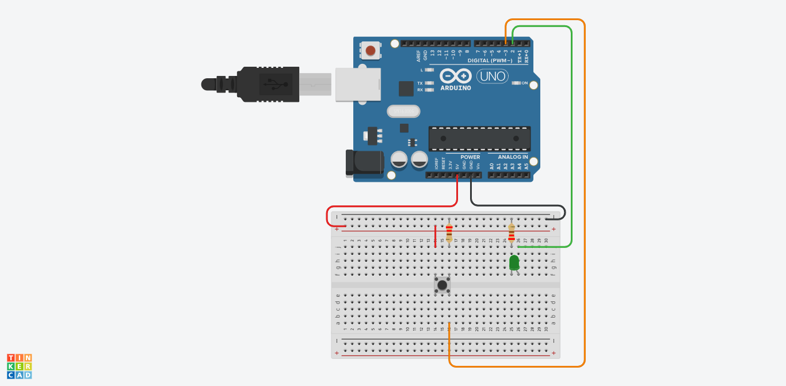

# Atividade Aula 09

>PROFº FELIPE SANTOS DE JESUS

>ALUNO: IZAEL ALVES DA SILVA - RA: 922114939

>DISCIPLINA: INTERNET DAS COISAS (IOT) - TURMA 50 - MM

<br>

## 1. Adicione um LED e um botão, ao aperta 1 vez ele acende o LED na segunda vez ele apaga!
>Enviar o circuito do Arduino e o código em C++

<br/>



<br/>

**Código em C++ 👇**
```c++

  //LED conectado ao pino 2
  int LED = 2; 

  //Botão conectado ao pino ~3
  int BOTAO = 3; 

  //Variável para leitura do estado do Botão
  int ESTADO_BOTAO = 0; 

  int VAR = 0;
  int VAR2 = 0;

  void setup(){
    //Pino 2 do arduino como saída
    pinMode(LED, OUTPUT); 
    
    //Pino ~3 com botão será entrada
    pinMode(BOTAO, INPUT); 
  }

  void loop(){
    //Armazena o Estado do botão.
    VAR = digitalRead(BOTAO);	
    
    //Se sim grava LOW (0) na variável
    //Se não grava HIGH (1) na variável
    //Se botão estiver pressionado (HIGH)
    if (VAR == 1 && VAR2 == 0){
      ESTADO_BOTAO = 1 - ESTADO_BOTAO;
      //delay(20);
    }
    
    VAR2 = VAR;
    
    if(ESTADO_BOTAO == 1){   
      //Acende o led conectado ao pino 2
    digitalWrite(LED, 1);
    }else{
      //Apaga o led conectado ao pino 2
      digitalWrite(LED, 0);
    }
  }

```

<br>
<hr>

>Para executar o circuito e fazer testes, clique neste link para ser redirecionando ao 🔗[Tinkedcad - Atividade - Aula 09](https://www.tinkercad.com/things/0v6VwpBmZl6-fantabulous-gogo/editel?sharecode=1Zxu9HGKFz4iTWsze7FnJ8ofRrauai3CqwgJTfU8fAc)