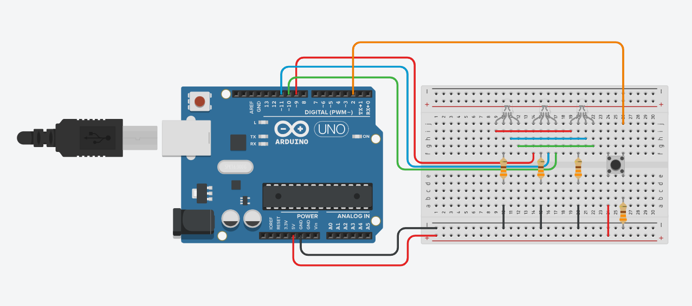

# Atividade Aula 11

>PROFº FELIPE SANTOS DE JESUS

>ALUNO: IZAEL ALVES DA SILVA - RA: 922114939

>DISCIPLINA: INTERNET DAS COISAS (IOT) - TURMA 50 - MM

<br>

## 1. Fazer no Arduino: Adicionar um Led RGB e um botão:

1. Ao clicar no botão 1ª vez: piscar as cores primárias
2. Ao clicar no botão 2ª vez: piscar as cores secundárias:
3. Ao clicar no botão 3ª vez: piscar branco
4. Ao clicar no botão 4ª vez: Apaga o LED

>Enviar o circuito do Arduino e o código em C++

<br/>



<br/>

**Código em C++ 👇**
```c++

  const int buttonPin = 2; // Pino conectado ao botão
  const int ledPinRed = 9; // Pino do LED vermelho
  const int ledPinGreen = 10; // Pino do LED verde
  const int ledPinBlue = 11; // Pino do LED azul

  int buttonState = LOW; // Variável para armazenar o estado do botão
  int lastButtonState = LOW; // Variável para armazenar o último estado do botão
  int colorMode = 0; // Variável para controlar o modo de cor

  void setup(){
    // Inicializa o pino do BOTÃO como entrada
    pinMode(buttonPin, INPUT);
    
    // Inicializa os pinos do LED RGB como saídas
    pinMode(ledPinRed, OUTPUT);
    pinMode(ledPinGreen, OUTPUT);
    pinMode(ledPinBlue, OUTPUT);
  }

  void loop(){
    buttonState = digitalRead(buttonPin);

    if (buttonState != lastButtonState) {
      if (buttonState == HIGH) {
        colorMode = (colorMode + 1) % 4;
        changeColorMode(colorMode);
      }
      lastButtonState = buttonState;
    }
  }

  // Função para configurar a cor do LED RGB
  void changeColorMode(int colorMode) {  
    // Desliga o LED RGB
    digitalWrite(ledPinRed, LOW);
    digitalWrite(ledPinGreen, LOW);
    digitalWrite(ledPinBlue, LOW);

    // Define as cores com base no modo
    if (colorMode == 1) {  // Cores primárias
      digitalWrite(ledPinRed, HIGH);
      digitalWrite(ledPinGreen, LOW);
      digitalWrite(ledPinBlue, LOW);
      delay(1000);
      digitalWrite(ledPinRed, LOW);
      digitalWrite(ledPinGreen, HIGH);
      digitalWrite(ledPinBlue, LOW);
      delay(1000);
      digitalWrite(ledPinRed, LOW);
      digitalWrite(ledPinGreen, LOW);
      digitalWrite(ledPinBlue, HIGH);
      
    } else if (colorMode == 2) {  // Cores secundárias
      digitalWrite(ledPinRed, HIGH);
      digitalWrite(ledPinGreen, HIGH);
      digitalWrite(ledPinBlue, LOW);
      delay(1000);
      digitalWrite(ledPinRed, HIGH);
      digitalWrite(ledPinGreen, LOW);
      digitalWrite(ledPinBlue, HIGH);
      delay(1000);
      digitalWrite(ledPinRed, LOW);
      digitalWrite(ledPinGreen, HIGH);
      digitalWrite(ledPinBlue, HIGH);
      
    } else if (colorMode == 3) {  // Branco
      digitalWrite(ledPinRed, HIGH);
      digitalWrite(ledPinGreen, HIGH);
      digitalWrite(ledPinBlue, HIGH);
    }
  }

```

<br>
<hr>

>Para executar o circuito e fazer testes, clique neste link para ser redirecionando ao 🔗[Tinkedcad - Atividade - Aula 09](https://www.tinkercad.com/things/6Gd48ZRKvuT)