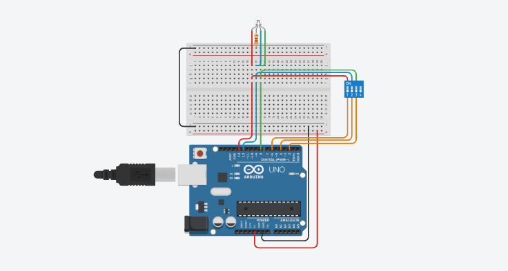
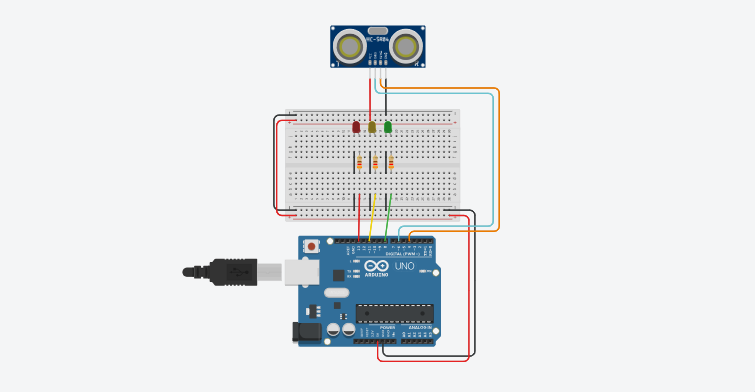

# Atividade Aula 12

>PROFº FELIPE SANTOS DE JESUS

>ALUNO: IZAEL ALVES DA SILVA - RA: 922114939

>DISCIPLINA: INTERNET DAS COISAS (IOT) - TURMA 50 - MM

<br>

## Atividade 1
Adicionar um LED RGB e um Interruptor DIP DPST x4
Escolher 3 interruptores para acender cada uma das 3 cores do LED.

>Enviar o circuito do Arduino e o código em C++

<br/>



<br/>

**Código em C++ 👇**
```c++

  void setup(){
  pinMode(8, OUTPUT);
  pinMode(12, OUTPUT);
  pinMode(13, OUTPUT);
  
  pinMode(2, INPUT_PULLUP);
  pinMode(4, INPUT_PULLUP);
  pinMode(6, INPUT_PULLUP);
}

void loop(){
  if(digitalRead(6) == LOW){
    digitalWrite(13, HIGH);
  }else{
  	digitalWrite(13, LOW);
  }
  
  if(digitalRead(4) == LOW){
    digitalWrite(12, HIGH);
  }else{
  	digitalWrite(12, LOW);
  }
  
  if(digitalRead(2) == LOW){
    digitalWrite(8, HIGH);
  }else{
  	digitalWrite(8, LOW);
  }
}

```

>Para executar o circuito e fazer testes, clique neste link para ser redirecionando ao 🔗[Tinkedcad - Atividade - Aula 12/01](https://www.tinkercad.com/things/9spzDlPkaUi)

---

<br/>
<br/>

## Atividade 2
* Adicionar 3 Leds comuns (Vermelho, Amarelo e Verde).
* Adicionar um sensor ultrassonico HC-SR04. Escolher um padrão de proximidade onde em algum momento ele acenda, o led vermelho se tiver muito próximo, o amarelo em um certa distancia e o verde se tiver distante.

<br/>



<br>

**Código em C++ 👇**
```c++

  void setup() {
    pinMode(6, OUTPUT); //pind do TRIG
    pinMode(4, INPUT); //pin do ECHO
    pinMode(13, OUTPUT); //pin da RED LED
    pinMode(11, OUTPUT); // pin da YELLOW LED
    pinMode(8, OUTPUT); //pin da GREEN LED
  }

  void loop() {
    long duration;
    int distance;

    digitalWrite(6, LOW);
    delay(20);
    digitalWrite(6, HIGH);
    delay(20);
    digitalWrite(6, LOW);

    duration = pulseIn(4, HIGH);
    distance = duration * 0.034 / 2;

    if (distance > 0 && distance <= 50) {
      digitalWrite(8, LOW);
      digitalWrite(11, LOW); 
      digitalWrite(13, HIGH);
      
    } else if(distance > 50 && distance <= 150){
      digitalWrite(8, LOW);
      digitalWrite(11, HIGH); 
      digitalWrite(13, LOW);
      
    }else{
      digitalWrite(8, HIGH);
      digitalWrite(11, LOW); 
      digitalWrite(13, LOW);
    }
  }

```

---

>Para executar o circuito e fazer testes, clique neste link para ser redirecionando ao 🔗[Tinkedcad - Atividade - Aula 12/02](https://www.tinkercad.com/things/fv2fjCfTzck)