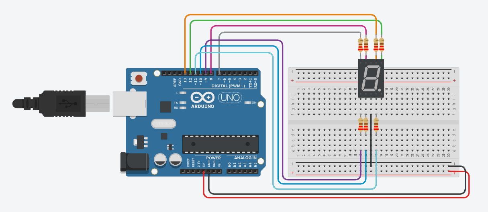

# Atividade Aula 13

>PROFº FELIPE SANTOS DE JESUS

>ALUNO: IZAEL ALVES DA SILVA - RA: 922114939

>DISCIPLINA: INTERNET DAS COISAS (IOT) - TURMA 50 - MM

<br>

## 1. Criar um circuito com um visor de 7 segmentos(Deixar como Catodo). Fazer ele contar do 0 ao 9;

>Enviar o circuito do Arduino e o código em C++

<br/>



<br/>

**Código em C++ 👇**
```c++

  int a = 13, b = 12, c = 11, d = 10, e = 9, f = 8, g = 7;
  int buttonPin = 2, leitura = 0, ultleitura = 0, contador = 0;

  void setup(){
    pinMode(a, OUTPUT);
    pinMode(b, OUTPUT);
    pinMode(c, OUTPUT);
    pinMode(d, OUTPUT);
    pinMode(e, OUTPUT);
    pinMode(f, OUTPUT);
    pinMode(g, OUTPUT);
    pinMode(buttonPin, INPUT);
    Serial.begin(9600);
  }

  //Função para escrever o nº zero
  void zero() {
    digitalWrite(a, 1);
    digitalWrite(b, 1);
    digitalWrite(c, 1);
    digitalWrite(d, 1);
    digitalWrite(e, 1);
    digitalWrite(f, 1);
    digitalWrite(g, 0);
    delay(1000);
  }
  //Função para escrever o nº um
  void um() {
    digitalWrite(a, 0);
    digitalWrite(b, 1);
    digitalWrite(c, 1);
    digitalWrite(d, 0);
    digitalWrite(e, 0);
    digitalWrite(f, 0);
    digitalWrite(g, 0);
    delay(1000);
  }
  //Função para escrever o nº dois
  void dois() {
    digitalWrite(a, 1);
    digitalWrite(b, 1);
    digitalWrite(c, 0);
    digitalWrite(d, 1);
    digitalWrite(e, 1);
    digitalWrite(f, 0);
    digitalWrite(g, 1);
    delay(1000);
  }
  //Função para escrever o nº três
  void tres() {
    digitalWrite(a, 1);
    digitalWrite(b, 1);
    digitalWrite(c, 1);
    digitalWrite(d, 1);
    digitalWrite(e, 0);
    digitalWrite(f, 0);
    digitalWrite(g, 1);
    delay(1000);
  }
  //Função para escrever o nº quatro
  void quatro() {
    digitalWrite(a, 0);
    digitalWrite(b, 1);
    digitalWrite(c, 1);
    digitalWrite(d, 0);
    digitalWrite(e, 0);
    digitalWrite(f, 1);
    digitalWrite(g, 1);
    delay(1000);
  }
  //Função para escrever o nº cinco
  void cinco() {
    digitalWrite(a, 1);
    digitalWrite(b, 0);
    digitalWrite(c, 1);
    digitalWrite(d, 1);
    digitalWrite(e, 0);
    digitalWrite(f, 1);
    digitalWrite(g, 1);
    delay(1000);
  }
  //Função para escrever o nº seis
  void seis() {
    digitalWrite(a, 1);
    digitalWrite(b, 0);
    digitalWrite(c, 1);
    digitalWrite(d, 1);
    digitalWrite(e, 1);
    digitalWrite(f, 1);
    digitalWrite(g, 1);
    delay(1000);
  }
  //Função para escrever o nº sete
  void sete() {
    digitalWrite(a, 1);
    digitalWrite(b, 1);
    digitalWrite(c, 1);
    digitalWrite(d, 0);
    digitalWrite(e, 0);
    digitalWrite(f, 0);
    digitalWrite(g, 0);
    delay(1000);
  }
  //Função para escrever o nº oito
  void oito() {
    digitalWrite(a, 1);
    digitalWrite(b, 1);
    digitalWrite(c, 1);
    digitalWrite(d, 1);
    digitalWrite(e, 1);
    digitalWrite(f, 1);
    digitalWrite(g, 1);
    delay(1000);
  }
  //Função para escrever o nº nove
  void nove() {
    digitalWrite(a, 1);
    digitalWrite(b, 1);
    digitalWrite(c, 1);
    digitalWrite(d, 1);
    digitalWrite(e, 0);
    digitalWrite(f, 1);
    digitalWrite(g, 1);
    delay(2000);
  }

  void loop(){
    switch (contador) {
      case 0:
        zero();
        break;
      case 1:
        um();
        break;
      case 2:
        dois();
        break;
      case 3:
        tres();
        break;
      case 4:
        quatro();
        break;
      case 5:
        cinco();
        break;
      case 6:
        seis();
        break;
      case 7:
        sete();
        break;
      case 8:
        oito();
        break;
      case 9:
        nove();
        break;
    }
    
    contador++;
    
    Serial.println(contador);
    if (contador > 9) {
      contador = 0;
    }
  }                               

```

<br>
<hr>

>Para executar o circuito e fazer testes, clique neste link para ser redirecionando ao 🔗[Tinkedcad - Atividade - Aula 13](https://www.tinkercad.com/things/eIjcb4x89xM)