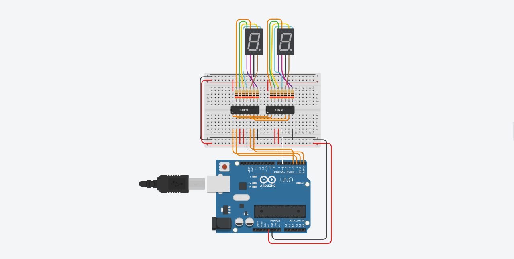

# Atividade Aula 14

>PROFº FELIPE SANTOS DE JESUS

>ALUNO: IZAEL ALVES DA SILVA - RA: 922114939

>DISCIPLINA: INTERNET DAS COISAS (IOT) - TURMA 50 - MM

<br>

## 1. Criar um circuito com 2 visores de 7 segmentos(Deixar como Catodo) e 2 decodificadores. Fazer ele contar do 0 ao 99;

>Enviar o circuito do Arduino e o código em C++

<br/>



<br/>

**Código em C++ 👇**
```c++

  char unidade = 6;
  char dezena = 7;

  void setup()
  {
    pinMode(unidade, OUTPUT);
    pinMode(dezena, OUTPUT);
    DDRD = 0B11111111;
  }

  void loop() {
    for(int i = 0; i <= 99; i++){
    
      PORTD = 0B11110000 | i/10;
      digitalWrite(dezena,LOW);
      PORTD = 0B11110000 | i%10;
      digitalWrite(unidade,LOW);
      delay(500);
    }
  }                          

```

<br>
<hr>

>Para executar o circuito e fazer testes, clique neste link para ser redirecionando ao 🔗[Tinkedcad - Atividade - Aula 14](https://www.tinkercad.com/things/iR6LZP8Hvn2-atividade-aula-14)