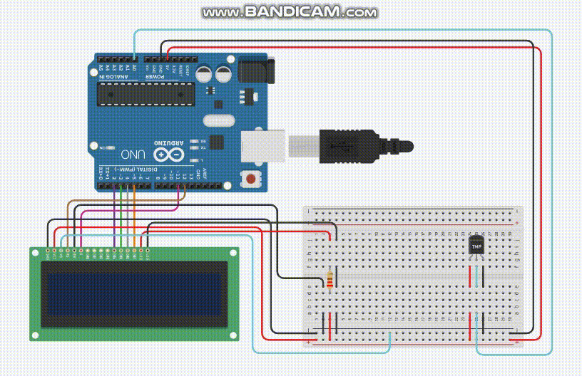
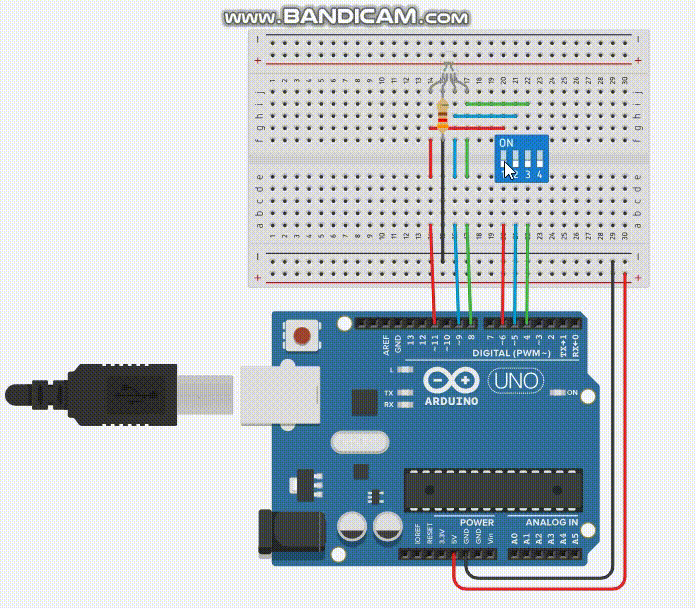
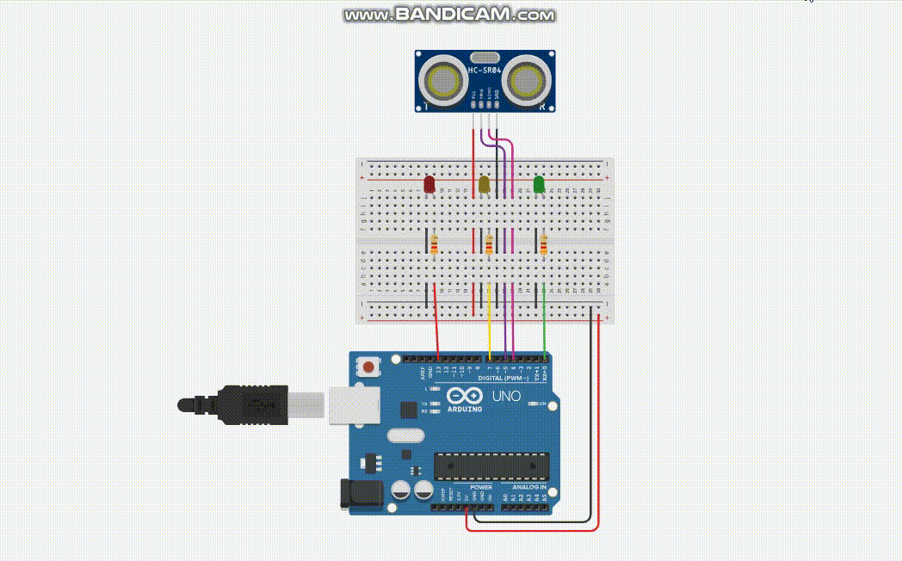

<div align="center">

# Prova 2 - Valendo 3 pontos | 29/11/2023
### Avaliação IoT - 2 - Valendo 3 pontos | 29/11/2023

>PROFº FELIPE SANTOS DE JESUS

>DISCIPLINA: INTERNET DAS COISAS (IOT) - TURMA 50 - MM

<br>

---
MENU

[Pergunta 01](#pergunta-01---integre-um-sensor-de-temperatura-ao-seu-projeto-arduino-conectando-o-ao-pino-analógico-a0-desenvolva-um-código-que-leia-os-dados-do-sensor-e-exiba-a-temperatura-atual-em-celsius-e-em-fahrenheits-um-em-cada-linha-no-painel-de-lcd16x6cristal-líquido) | [Pergunta 02](#pergunta-02---explore-a-versatilidade-de-um-led-rgb-com-arduino-conectando-os-pinos-correspondentes-aos-canais-de-vermelho-verde-e-azul-em-um-interruptor-dip-com-4-botões-cada-botão-liga-uma-cor) | [Pergunta 03](#pergunta-03---incorpore-um-sensor-de-aproximação-ao-seu-projeto-arduino-conectando-o-a-um-pino-digital-elabore-um-código-que-detecte-a-proximidade-de-objetos-e-acione-um-led-rgb-e-mude-cor-de-acordo-com-a-aproximação--alterne-entre-4-cores)

---

<br>

**Feito por:**
| ALUNO                               | RA        |
|-------------------------------------|-----------|
| Deise Santos Da Silva               | 922114940 |
| Eversson Santana Serra Bela         | 922107547 |
| Gabriel Santos De Campos            | 922113898 |
| Izael Alves Da Silva                | 922114939 |
| Paulo Roberto da Silva Soares Filho | 921116535 |


<br>

#### Pergunta 01 - Integre um Sensor de Temperatura ao seu projeto Arduino, conectando-o ao pino analógico A0. Desenvolva um código que leia os dados do sensor e exiba a temperatura atual em Celsius e em Fahrenheits, um em cada linha no Painel de LCD(16x6)(Cristal Líquido).



>Para executar o circuito e fazer testes, clique neste link para ser redirecionando ao 🔗[Tinkedcad | prova 2 valendo 3 pontos questão 01](https://www.tinkercad.com/things/418WBhTuBGW-pergunta01?sharecode=lkOWdcbCERf0kp17loHpTOpyR01A2oe0BsNl9DuWP1A)

</div>

**Código em C++ 👇**
```c++
  #include <LiquidCrystal.h>

  LiquidCrystal lcd(12, 11, 2, 3, 4, 5);

  float celsius = 0.0;
  const int pinoSensor = A0;
  float temperatureCelsius = 0.0;
  float temperatureFahrenheit = 0.0;

  void setup() {
    lcd.begin(16, 2);
    lcd.clear();
  }

  void loop() {
    temperatureCelsius = map(((analogRead(pinoSensor) - 20) * 3.04), 0, 1023, -40, 125); 
    temperatureFahrenheit = temperatureCelsius * 9.0 / 5.0 + 32.0;
    
    lcd.setCursor(0, 0);
    lcd.print("Graus: ");
    lcd.print(temperatureCelsius);
    lcd.print(" C");

    lcd.setCursor(0, 1);
    lcd.print("Graus: ");
    lcd.print(temperatureFahrenheit);
    lcd.print(" F");
  }
```
---
<br>

<div align="center">

#### Pergunta 02 - Explore a versatilidade de um LED RGB com Arduino, conectando os pinos correspondentes aos canais de vermelho, verde e azul, em um interruptor DIP com 4 botões. Cada botão liga uma cor.



>Para executar o circuito e fazer testes, clique neste link para ser redirecionando ao 🔗[Tinkedcad | prova 2 valendo 3 pontos pergunta 02](https://www.tinkercad.com/things/fYJnMpGPYmv-pergunta02?sharecode=g8BCd4-b8_obBprW-a585zzaMWoWJy0uEAaSw5m_Dcs)

</div>

Código em C++ 👇
```c++

  void setup(){
    pinMode(8, OUTPUT);
    pinMode(9, OUTPUT);
    pinMode(11, OUTPUT);
    
    pinMode(4, INPUT_PULLUP);
    pinMode(5, INPUT_PULLUP);
    pinMode(6, INPUT_PULLUP);
  }

  void loop(){
    if(digitalRead(6) == LOW){
      digitalWrite(11, HIGH);
    }else{
      digitalWrite(11, LOW);
    }
    
    if(digitalRead(5) == LOW){
      digitalWrite(9, HIGH);
    }else{
      digitalWrite(9, LOW);
    }
    
    if(digitalRead(4) == LOW){
      digitalWrite(8, HIGH);
    }else{
      digitalWrite(8, LOW);
    }
  }
  
```

---

<br/>

<div align="center">

#### Pergunta 03 - Incorpore um Sensor de Aproximação ao seu projeto Arduino, conectando-o a um pino digital. Elabore um código que detecte a proximidade de objetos e acione um LED RGB e mude cor de acordo com a aproximação , alterne entre 4 cores.

<br/>



>Para executar o circuito e fazer testes, clique neste link para ser redirecionando ao 🔗[Tinkedcad | prova 2 valendo 3 pontos pergunta 03](https://www.tinkercad.com/things/8af9RsFDzNI-pergunta03?sharecode=N16zX1RlOlFjETM3w6rh8XlHJM2edmkYwtt8FASxyQ4)
</div>
<br/>

**Código em C++ 👇**
```c++

  void setup() {
    pinMode(5, OUTPUT); //pind do TRIG
    pinMode(4, INPUT); //pin do ECHO
    pinMode(13, OUTPUT); //pin da RED LED
    pinMode(7, OUTPUT); // pin da YELLOW LED
    pinMode(0, OUTPUT); //pin da GREEN LED
  }

  void loop() {
    long duration;
    int distance;

    digitalWrite(5, LOW);
    delay(20);
    digitalWrite(5, HIGH);
    delay(20);
    digitalWrite(5, LOW);

    duration = pulseIn(4, HIGH);
    distance = duration * 0.034 / 2;

    if (distance <= 100) {
      digitalWrite(0, LOW);
      digitalWrite(7, LOW); 
      digitalWrite(13, HIGH);
      
    } else if(distance <= 200){
      digitalWrite(0, LOW);
      digitalWrite(7, HIGH); 
      digitalWrite(13, LOW);
      
    }else{
      digitalWrite(0, HIGH);
      digitalWrite(7, LOW); 
      digitalWrite(13, LOW);
    }
  }

```

<br>
<br>
<br>
<p align="center">⬅ Feito com 💖 para trabalho de faculdade ➡</p>