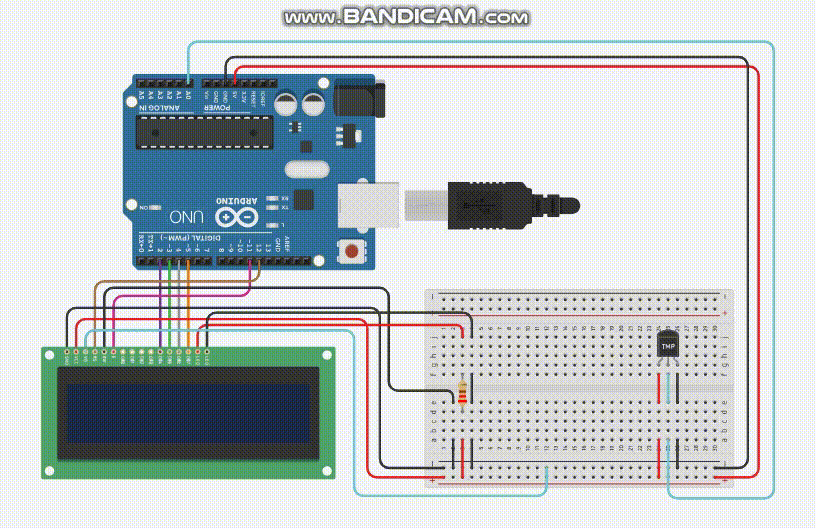

# Prova 2 - Valendo 3 pontos | 29/11/2023
### Avaliação IoT - 2 - Valendo 3 pontos | 29/11/2023

>PROFº FELIPE SANTOS DE JESUS

>ALUNO: IZAEL ALVES DA SILVA - RA: 922114939

>DISCIPLINA: INTERNET DAS COISAS (IOT) - TURMA 50 - MM

<br>

#### 1. Integre um Sensor de Temperatura ao seu projeto Arduino, conectando-o ao pino analógico A0. Desenvolva um código que leia os dados do sensor e exiba a temperatura atual em Celsius e em Fahrenheits, um em cada linha no Painel de LCD(15x2)(Cristal Líquido).



>Para executar o circuito e fazer testes, clique neste link para ser redirecionando ao 🔗[Tinkedcad | prova 2 valendo 3 pontos questão 01](https://www.tinkercad.com/things/418WBhTuBGW-prova-2-valendo-tres-pontos-q1)

**Código em C++ 👇**
```c++
  #include <LiquidCrystal.h>

  LiquidCrystal lcd(12, 11, 2, 3, 4, 5);

  float celsius = 0.0;
  const int pinoSensor = A0;
  float temperatureCelsius = 0.0;
  float temperatureFahrenheit = 0.0;

  void setup() {
    lcd.begin(16, 2);
    lcd.clear();
  }

  void loop() {
    temperatureCelsius = map(((analogRead(pinoSensor) - 20) * 3.04), 0, 1023, -40, 125); 
    temperatureFahrenheit = temperatureCelsius * 9.0 / 5.0 + 32.0;
    
    lcd.setCursor(0, 0);
    lcd.print("Graus: ");
    lcd.print(temperatureCelsius);
    lcd.print(" C");

    lcd.setCursor(0, 1);
    lcd.print("Graus: ");
    lcd.print(temperatureFahrenheit);
    lcd.print(" F");
  }
```
---
<br>

#### 2 - Explore a versatilidade de um LED RGB com Arduino, conectando os pinos correspondentes aos canais de vermelho, verde e azul, em um interruptor DIP com 4 botões. Cada botão liga uma cor.

---

#### 3 - Incorpore um Sensor de Aproximação ao seu projeto Arduino, conectando-o a um pino digital. Elabore um código que detecte a proximidade de objetos e acione um LED RGB e mude cor de acordo com a aproximação , alterne entre 4 cores.

---

<br/>

<!--  -->

<br/>

**Código em C++ 👇**
```c++

```

<br>
<hr>

>Para executar o circuito e fazer testes, clique neste link para ser redirecionando ao 🔗[Tinkedcad - Atividade - Aula 14](https://www.tinkercad.com/things/iR6LZP8Hvn2-atividade-aula-14)