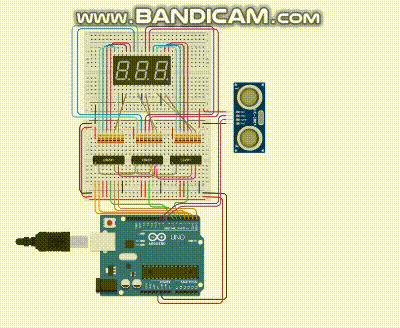

<div align="center">




## Trabalho 02 | Recuperação de nota do trabalho 01 | 11/12/2023

</div>

<br>

>PROFº FELIPE SANTOS DE JESUS

>ALUNO: IZAEL ALVES DA SILVA - RA: 922114939

>DISCIPLINA: INTERNET DAS COISAS (IOT) - TURMA 50 - MM

<br>

#  💬 Instruções do trabalho.
1. *Faça um circuito que use dois visores de 7 segmentos(passado em sala de aula), e um sensor de aproximação. Nos visores de 7 segmentos deve aparecer a distância do Sensor de aproximação, provavelmente você vão trabalhar com centímetros, por isso os dois Visores de 7 segmentos.*

<br>

>Para executar o circuito e fazer testes, clique neste link para ser redirecionando ao 🔗[Tinkedcad | Trabalho 02 - recuperação de nota do trabalho 01](https://www.tinkercad.com/things/1YtoJcWUrd5-trabalho2recuperacaodenotadotrabalho1?sharecode=f8SutAG7p2Iv1ZpIs9oGSlEfXuT5ZKF3Q62BM1HJa1c)

<br>

**Código fonte em C++ 👇**
```c++

  const int PIN_ECHO = 8;
  const int PIN_TRIG = 9;

  const int UNIDADE = 4;
  const int DEZENA = 5;
  const int CENTENA = 6;

  long duration;
  int distance;

  void setup(){  
    pinMode(UNIDADE, OUTPUT);
    pinMode(DEZENA, OUTPUT);
    pinMode(CENTENA, OUTPUT);
    
    pinMode(PIN_TRIG, OUTPUT);
    pinMode(PIN_ECHO, INPUT);
    
    DDRD = 0B11111111;
  }

  void loop(){ 
    digitalWrite(PIN_TRIG, LOW);
    delay(200);
    digitalWrite(PIN_TRIG, HIGH);
    delay(200);
    digitalWrite(PIN_TRIG, LOW);
    
    duration = pulseIn(PIN_ECHO, HIGH);
    distance = (duration * 0.034) / 2;
    
    PORTD = 0B11110000 | distance/100;
    digitalWrite(CENTENA, LOW);
    
    PORTD = 0B11110000 | ((distance / 10) % 10);
    digitalWrite(DEZENA, LOW);

    PORTD = 0B11110000 | distance%10;
    digitalWrite(UNIDADE, LOW);
  }

```

<br>

<p align="center">⬅ Feito com 💖 para trabalho de faculdade ➡</p>