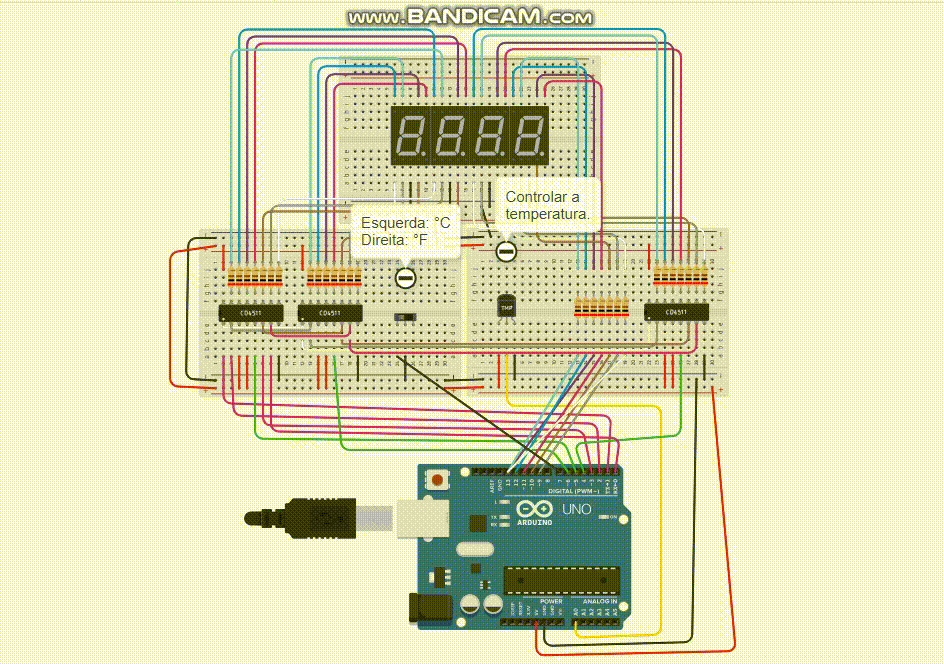

## Trabalho Arduino | 29/11/2023 | valendo 3 pontos AV1

>PROFº FELIPE SANTOS DE JESUS

>DISCIPLINA: INTERNET DAS COISAS (IOT) - TURMA 50 - MM

<br>

**Feito por:**
| ALUNO                               | RA        |
|-------------------------------------|-----------|
| Deise Santos Da Silva               | 922114940 |
| Eversson Santana Serra Bela         | 922107547 |
| Gabriel Santos De Campos            | 922113898 |
| Izael Alves Da Silva                | 922114939 |
| Paulo Roberto da Silva Soares Filho | 921116535 |


<br>

## Neste projeto, você desenvolverá um sistema de exibição de temperatura com a capacidade de alternar entre as unidades de temperatura Fahrenheit (F) e Celsius. Usando um interruptor DIP.

**O sistema será composto por:**
* 4 Painéis de 7 segmentos.
* 4 Decodificador de 7 segmentos 4511.
* 1 interruptor DIP.
* 1 sensor de temperatura.

*O sensor de temperatura medirá a temperatura ambiente e enviará os dados para a placa Arduino.A placa Arduino converterá a temperatura de Celsius para Fahrenheit ou vice-versa, dependendo da posição do interruptor DIP.*

*A temperatura convertida será exibida nos 3 painéis de 7 segmentos, enquanto o quarto painel de 7 segmentos exibirá ```"F"``` para Fahrenheit ou ```"C"``` para Celsius, indicando a unidade atual.*

1. Os valores nos painéis de 7 segmentos devem ser atualizados continuamente para refletir as mudanças de temperatura e unidade.

2. O interruptor DIP permitirá ao usuário alternar entre Fahrenheit e Celsius, atualizando a unidade de exibição em tempo real.

3. Conecte os painéis de 7 segmentos e o decodificador 4511 à placa Arduino para exibir os valores da temperatura e a unidade.

4. Conecte o sensor de temperatura à placa Arduino para medir a temperatura ambiente.

5. Conecte o interruptor DIP à placa Arduino para alternar entre Fahrenheit e Celsius.

6. Teste o sistema para garantir que ele exibe a temperatura e a unidade corretamente.

7. Verifique se a comutação entre Fahrenheit e Celsius funciona conforme o esperado quando o interruptor DIP é alterado.

8. Realize testes de temperatura para verificar a precisão das conversões. 

<br>
<br>



>Para executar o circuito e fazer testes, clique neste link para ser redirecionando ao 🔗[Tinkedcad | Trabalho Arduino | valendo 3 pontos AV1](https://www.tinkercad.com/things/iFaubx9u4Uf-trabalhoarduinovalendo3pontosav1?sharecode=6BrAqfcQcaBt76tLOhsuQbc7KHhD6GjvQx-eXGLGnOI)

<br>

**Código em C++ 👇**
```c++

  const int AFE = 13;
  const int G = 12;
  const int B = 11;
  const int C = 10;
  const int D = 9;

  char unidade = 4;
  char dezena = 5;
  char centena = 6;

  const int pinoSensor = A0;
  int temperatureCelsius = 0;
  int temperatureFahrenheit = 0;

  int pinoInterruptorDeslizante = 7;

  void setup(){
    pinMode(AFE, OUTPUT);
    pinMode(G, OUTPUT);
    pinMode(B, OUTPUT);
    pinMode(C, OUTPUT);
    pinMode(D, OUTPUT);
    
    pinMode(unidade, OUTPUT);
    pinMode(dezena, OUTPUT);
    pinMode(centena, OUTPUT);
      
    //Serial.begin(9600);

    DDRD = 0B11111111;
  }

  //Função para mostrar a letra "C"
  void letraC() {
    digitalWrite(AFE, HIGH);
    digitalWrite(G, LOW);
    digitalWrite(B, LOW);
    digitalWrite(C, LOW);
    digitalWrite(D, HIGH);
  }

  //Função para escrever mostar a letra "F"
  void letraF() {
    digitalWrite(AFE, HIGH);
    digitalWrite(G, HIGH);
    digitalWrite(B, LOW);
    digitalWrite(C, LOW);
    digitalWrite(D, LOW);
  }

  void loop() {
    int valorInterruptorDeslizante = digitalRead(pinoInterruptorDeslizante);
            
    // Leia a temperatura do sensor
    temperatureCelsius = map(((analogRead(pinoSensor) - 20) * 3.04), 0, 1023, -40, 125); 

    // Converta a temperatura Celsius para Fahrenheit
    temperatureFahrenheit = temperatureCelsius * 9.0 / 5.0 + 32.0; 
    
    if(valorInterruptorDeslizante == 0){
      
      if(temperatureCelsius < 0) {
        temperatureCelsius = temperatureCelsius * (-1);
      }
      
      PORTD = 0B11110000 | temperatureCelsius/100;
      digitalWrite(centena,LOW);

      PORTD = 0B11110000 | ((temperatureCelsius / 10) % 10);
      digitalWrite(dezena,LOW);

      PORTD = 0B11110000 | temperatureCelsius%10;
      digitalWrite(unidade,LOW); 

      letraC();
      
    }else{
      
      if(temperatureFahrenheit < 0) {
        temperatureFahrenheit = temperatureFahrenheit * (-1);
      }
      
      PORTD = 0B11110000 | temperatureFahrenheit/100;
      digitalWrite(centena,LOW);

      PORTD = 0B11110000 | ((temperatureFahrenheit / 10) % 10);
      digitalWrite(dezena,LOW);

      PORTD = 0B11110000 | temperatureFahrenheit%10;
      digitalWrite(unidade,LOW); 
      
      letraF();
      
    }
  }

```

<br>
<br>
<br>
<p align="center">⬅ Feito com 💖 para trabalho de faculdade ➡</p>