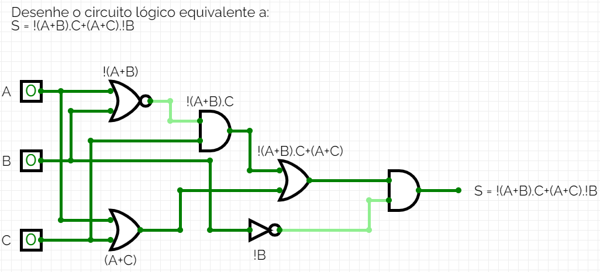

# Exercício 11 | 25/09/2023

>PROFº MARCIO KLEIN

>ALUNO: IZAEL ALVES DA SILVA - RA: 922114939

>DISCIPLINA: ORGANIZAÇÃO E ARQUETETURA DE COMPUTADORES - TURMA 50 - MM

<br>

## 1. Desenhe o circuito lógico equivalente a: ```S = !(A+B).C+(A+C).!B```

 