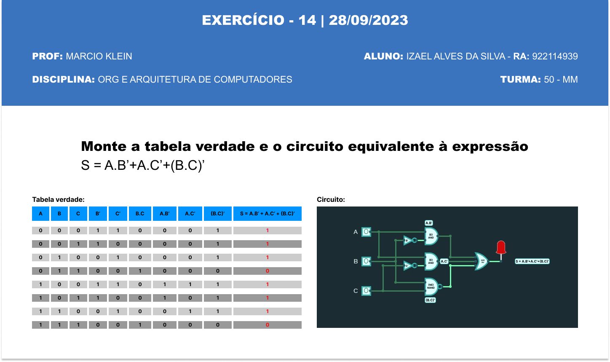

# Exercício 14 | 28/09/2023

>PROFº MARCIO KLEIN

>ALUNO: IZAEL ALVES DA SILVA - RA: 922114939

>DISCIPLINA: ORGANIZAÇÃO E ARQUETETURA DE COMPUTADORES - TURMA 50 - MM

<br>

## 1. Monte a tebela verdade e o circuito equivalente à expressão: ```S = A.B'+A.C'+(B.C)'```

 

<br/>

 Para testar o circuito acesse este link: [CircuitVerse🔗](https://circuitverse.org/simulator/embed/untitled-0ae636f5-25e6-4e6b-92b0-c863592b6d3c?theme=night-sky&display_title=false&clock_time=false&fullscreen=false&zoom_in_out=true)