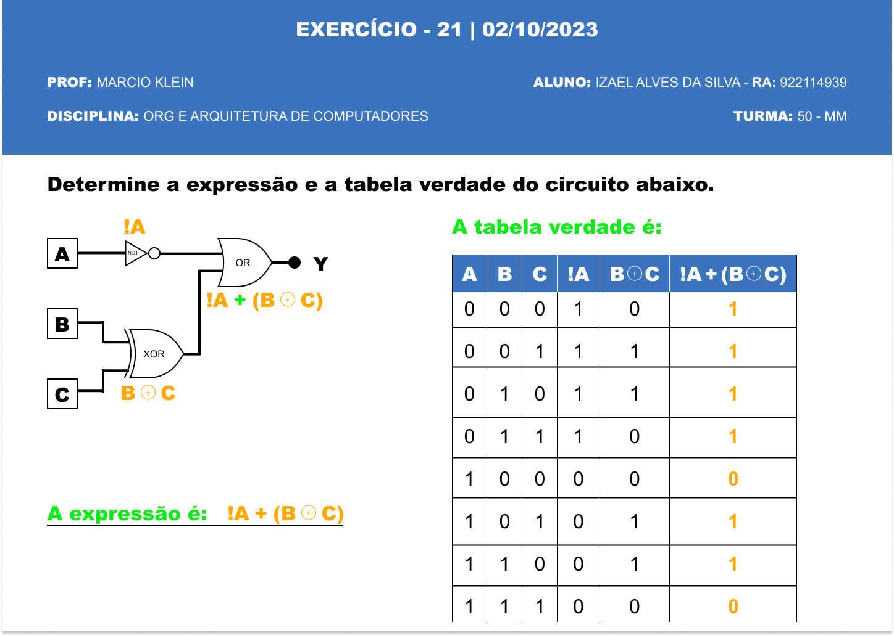

# Exercício 21 | 02/10/2023

>PROFº MARCIO KLEIN

>ALUNO: IZAEL ALVES DA SILVA - RA: 922114939

>DISCIPLINA: ORGANIZAÇÃO E ARQUETETURA DE COMPUTADORES - TURMA 50 - MM

 

## 1. Determine a expressão e a tabela verdade do circuito da imagem abaixo.

 

  

 Para testar o circuito acesse este link: [CircuitVerse🔗](https://circuitverse.org/simulator/embed/exercicio-21-circuito?theme=night-sky&display_title=false&clock_time=false&fullscreen=false&zoom_in_out=false)
