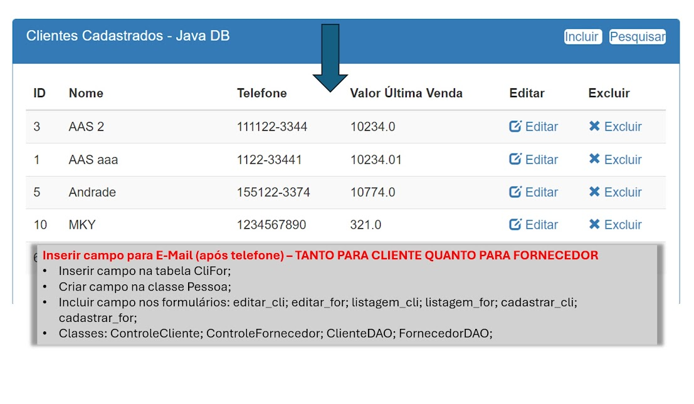
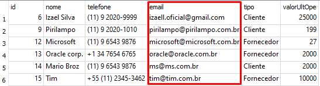
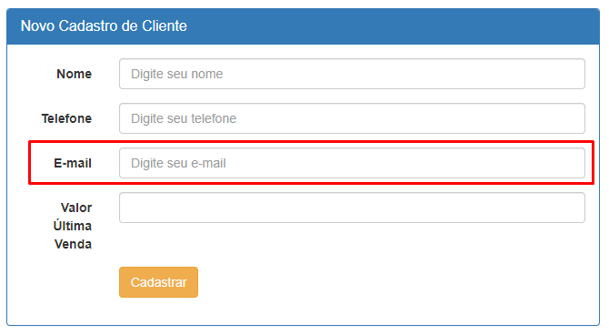
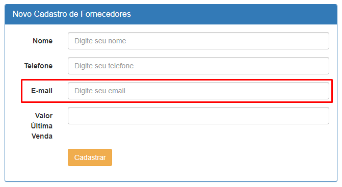
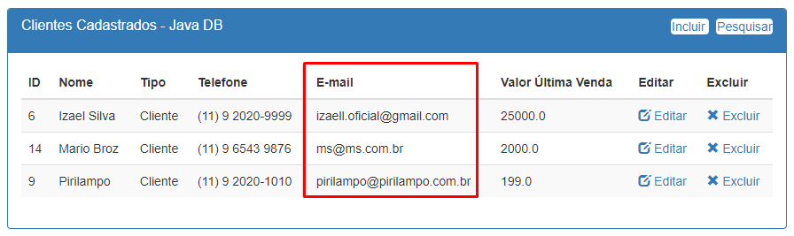
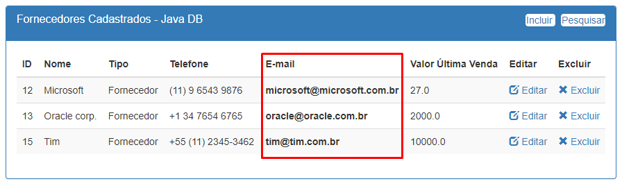
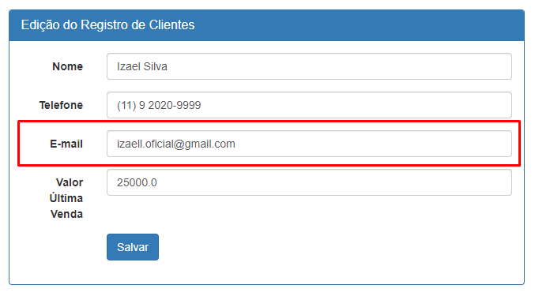
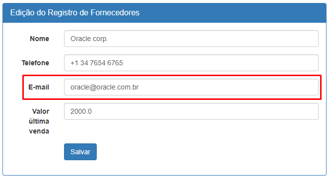

# APLICAÇÕES ORIENTADAS A OBJETOS - TURMA 24 - MM

### ATIVIDADE CRUD - 2024-05-09
<br>

| PROF | ALUNO | RA |
|----------|----------|----------|
| ANTONIO ANDRADE   | PAULO ROBERTO SOARES   | 921116535   |

---

### Acrescentar campo de e-mail no projeto que estamos desenvolvendo. 
1. Passo a passo, em anexo.
2. Projeto atualizado hoje, em anexo.
3. A atividade pode ser realizada em qualquer BD.

> Se houver alguém, por ventura, que não esteja conseguindo fazer na prática, crie um documento relatando o problema e descreva passo a passo o que deveria ser feito no código para a realização da inclusão do campo e-mail solicitado.



<br>

## Banco dados
1. Fazendo alteração no banco de dados e adicionando a coluna `email`
```sql
  ALTER TABLE CliFor ADD COLUMN email;
```

## Classe `Pessoa.java`
1. Na classe `Pessoa.java` do pacote `model.bean` adicionei o bloco de código abaixo:
```java
  private String email;

  public String getEmail() {
    return email;
  }

  public void setEmail(String email) {
    this.email = email;
  }
```

## Cliente
1. No pacote `view`
2. Na classe `editar_cli.jsp`
3. Adicionei o bloco de código:
```html
  <div class="form-group">
    <label for="inputEmail" class="col-lg-2 control-label">E-mail</label>
    <div class="col-lg-10">
        <input type="email" class="form-control" id="inputEmail" name="email" placeholder="Digite seu email" value="<%=c.getEmail()%>">
    </div>
  ```
4. Na classe `listagem_cli.jsp`
  ```html
    <th>E-mail</th>
    <td><%=c.getEmail()%></td>
  ```


* Na classe `cadastrar_cli.jsp`

  * Adicionei o bloco de codigo:
    
    * ```html
        <div class="form-group">
          <label for="inputEmail" class="col-lg-2 control-label">E-mail</label>
          <div class="col-lg-10">
            <input type="email" class="form-control" id="inputEmail" name="email" placeholder="Digite seu e-mail" value="">
          </div>
        </div>
      ```


* No pacote `controller`

  * Na classe `ControleCliente.java`

    * Quando a ação é `cadastrar_cli` `if (request.getParameter("acao").contains("cadastrar_cli")) { ...`

      * ```java
          c.setEmail(request.getParameter("email"));
        ```
    * Quando a ação é `alterar_cli` `if (request.getParameter("acao").contains("alterar_cli")) { ...`

      * ```java
          c.setEmail(request.getParameter("email"));
        ```


* No pacote `model`

  * Na classe `ClienteDAO()` adicionei os código:

    * No metodo `inserir()`
      * > String sql = "INSERT INTO CliFor (nome, telefone, `email`, tipo, valorUltOper) VALUES (?, ?, ?, ?, ?) ";

      * ```java
        psI.setString(3, c.getEmail());
        ```
    * No metodo `editar()`

        * ```java
          psI.setString(3, c.getEmail());
          ```
    * No metodo `alterar()`

      * ```java
        psA.setString(3, p.getEmail());
        ```
    * No metodo `Listar()`

      * ```java
        cliente.setEmail(rs.getString("email"));
        ```

## Fornecedor
* No pacote `view`

  * Na classe `editar_for.jsp`

    * Adicionei o bloco de código:

      * ```html
        <div class="form-group">
            <label for="inputEmail" class="col-lg-2 control-label">E-mail</label>
            <div class="col-lg-10">
                <input type="email" class="form-control" id="inputEmail" name="email" placeholder="Digite seu email" value="<%=fornecedor.getEmail()%>">
            </div>
        </div>
        ```
  * Na classe `listagem_for.jsp`

    * ```html
      <th>E-mail</th>
      <th><%=forn.getEmail()%></th>
      ```


* Na classe `cadastrar_for.jsp`

  * Adicionei o bloco de codigo:
    
    * ```html
        <div class="form-group">
            <label for="inputEmail" class="col-lg-2 control-label">E-mail</label>
            <div class="col-lg-10">
                <input type="email" class="form-control" id="inputEmail" name="email" placeholder="Digite seu email" value="">
            </div>
        </div>
      ```


* No pacote `controller`

  * Na classe `ControleFornecedor.java`

    * Quando a ação é `cadastrar_for` `if (request.getParameter("acao").contains("cadastrar_for")) { ...`

      * ```java
          f.setEmail(request.getParameter("email"));
        ```
    * Quando a ação é `alterar_for` `if (request.getParameter("acao").contains("alterar_for")) { ...`

      * ```java
          f.setEmail(request.getParameter("email"));
        ```


* No pacote `model`

  * Na classe `FornecedorDAO` adicionei os código:

    * No metodo `inserir()`

      * > String sql = "INSERT INTO CliFor (nome, telefone, `email`, tipo, valorUltOper) VALUES (?, ?, ?, ?, ?)";

      * ```java
        psI.setString(3, fornecedor.getEmail());
        ```
    * No metodo `editar()`

        * ```java
          fornecedor.setEmail(rs.getString("email"));
          ```
    * No metodo `alterar()`

      * ```java
        psA.setString(3, fornecedor.getEmail());
        ```
    * No metodo `Listar()`

      * ```java
        fornecedor.setEmail(rs.getString("email"));
        ```

## Funcionamento após alterações.

* Banco de dados

  

<br>
<br>

* Cadastro

  

  

<br>
<br>

* Listagem

  

  

<br>
<br>

* Editando 

  

  