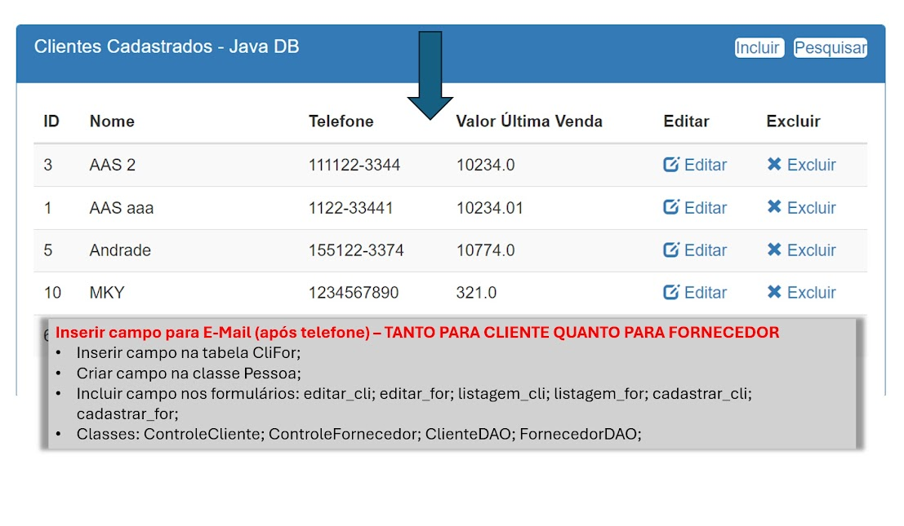

# APLICACOES ORIENTADAS A OBJETOS | TURMA 24 - MM

### 2024-05-09 - Atividade - CRUD
<br>

| PROF | ALUNO | RA |
|----------|----------|----------|
| ANTONIO ANDRADE   | IZAEL SILVA   | 922114939   |

---

### Acrescentar campo de e-mail no projeto que estamos desenvolvendo. 
* Passo a passo, em anexo.
* Projeto atualizado hoje, em anexo.
* A atividade pode ser realizada em qualquer BD.

> Se houver alguém, por ventura, que não esteja conseguindo fazer na prática, crie um documento relatando o problema e descreva passo a passo o que deveria ser feito no código para a realização da inclusão do campo e-mail solicitado.

<h3 style="color:red;text-transform:uppercase;">
  Inserir campo para E-Mail (após telefone) - TANTO PARA CLIENTE QUANTO PARA FORNECEDOR
</h3>

1. Inserir campo na tabela CliFor;

2. Criar campo na classe Pessoa;

3. Incluir campo nos formulários: <br>
`editar_cli;` `editar_for;` `listagem_cli;` `listagem_for;` `cadastrar_cli;` `cadastrar_for;`

4. Classes: <br>
`ControleCliente;` `Controle Fornecedor;` `ClienteDAO;` `FornecedorDAO;`

<br>



---

<br>
<br>

Na classe `Pessoa.java` do pacote `model.bean` adicionei o bloco de código abaixo:
```java

  private String email;

  public String getEmail() {
    return email;
  }

  public void setEmail(String email) {
    this.email = email;
  }

```

## Cliente
* No pacote `model`
  * Na classe `ClienteDAO()` adicionei os código:
    * No metodo `inserir()`
      * > String sql = "INSERT INTO CliFor (nome, telefone, `email`, tipo, valorUltOper) VALUES (?, ?, ?, ?, ?) ";
      * ```java
        psI.setString(3, c.getEmail());
        ```
    * No metodo `editar()`
        * ```java
          psI.setString(3, c.getEmail());
          ```
    * No metodo `alterar()`
      * ```java
        psA.setString(3, p.getEmail());
        ```
    * No metodo `Listar()`
      * ```java
        cliente.setEmail(rs.getString("email"));
        ```
## Fornecedor
* No pacote `model`
  * Na classe `FornecedorDAO` adicionei os código:
    * No metodo `inserir()`
      * > String sql = "INSERT INTO CliFor (nome, telefone, `email`, tipo, valorUltOper) VALUES (?, ?, ?, ?, ?)";
      * ```java
        psI.setString(3, fornecedor.getEmail());
        ```
    * No metodo `editar()`
        * ```java
          fornecedor.setEmail(rs.getString("email"));
          ```
    * No metodo `alterar()`
      * ```java
        psA.setString(3, fornecedor.getEmail());
        ```
    * No metodo `Listar()`
      * ```java
        fornecedor.setEmail(rs.getString("email"));
        ```