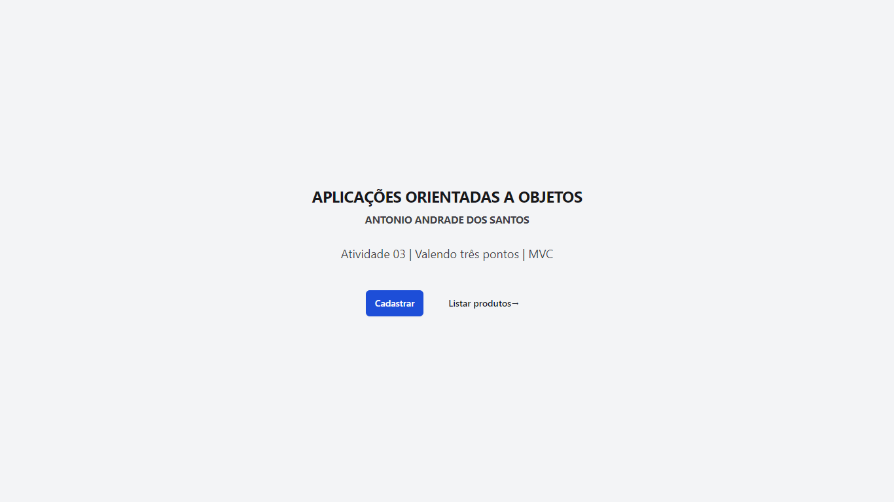
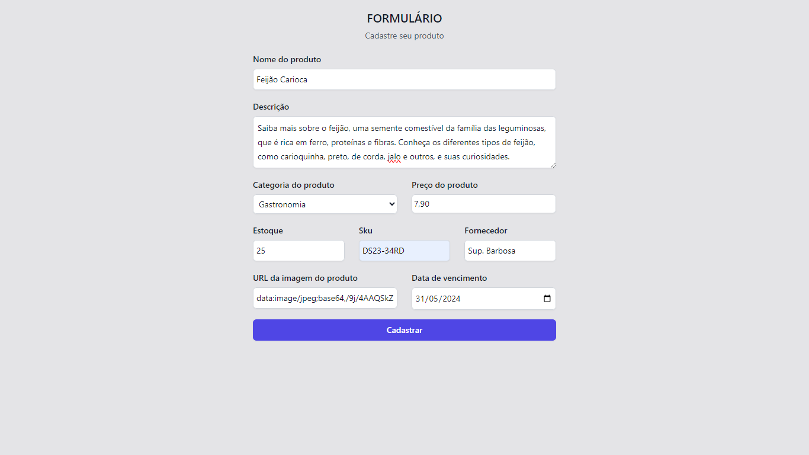
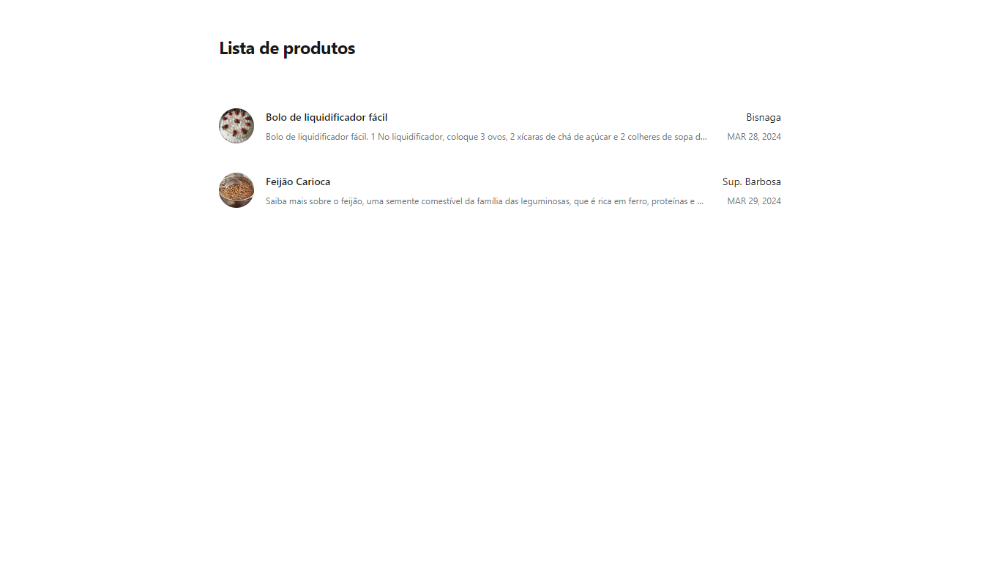
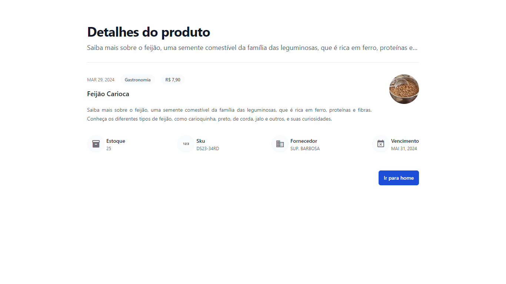

# Atividade 03 | Valendo três pontos | MVC
### APLICAÇÕES ORIENTADAS A OBJETOS
#### ANTONIO ANDRADE DOS SANTOS

---

<br>
<br>

Feito por
* *IZAEL ALVES DA SILVA - RA: 922114939*
* *DEIZE SANTOS DA SILVA - RA: 922114940*

---

<br>
<br>

##### PROJETO DE CADASTRO DE PRODUTOS, USANDO JAVA WEB COM WERVERLETS, TECNOLOGIAS APRENDIDAS EM SALA DE AULA.

* pagina `index.html`
```html
<!DOCTYPE html>
<html lang="pt-br">
    <head>
        <title>Atividade 03 | Valendo três pontos | MVC</title>
        <meta charset="UTF-8">
        <meta name="viewport" content="width=device-width, initial-scale=1.0">

        <script src="https://cdn.tailwindcss.com"></script>
    </head>
    <body>
        <div class="bg-gray-100 w-screen h-screen flex flex-col justify-center items-center">
            <div class="flex flex-col justify-center items-center mx-auto max-w-md lg:mx-0 lg:flex-auto lg:py-32 lg:text-left">
                <h2 class="font-bold tracking-tight text-zinc-900 sm:text-2xl">APLICAÇÕES ORIENTADAS A OBJETOS</h2>
                <span class="text-sm mt-2 font-bold tracking-tight text-zinc-700 sm:text-base">ANTONIO ANDRADE DOS SANTOS</span>
                <p class="mt-6 text-lg text-center leading-8 text-zinc-700">Atividade 03 | Valendo três pontos | MVC</p>
                <div class="mt-10 flex items-center justify-center gap-x-6 lg:justify-start">
                    <a href="register.html" class="rounded-md bg-blue-700 px-3.5 py-2.5 text-sm font-semibold text-white shadow-sm hover:bg-blue-600 focus-visible:outline focus-visible:outline-2 focus-visible:outline-offset-2 focus-visible:outline-white">Cadastrar</a>
                    <a href="list.jsp" class="rounded-md px-3.5 py-2.5 text-sm font-semibold text-gray-900 hover:bg-gray-200 focus-visible:outline focus-visible:outline-2 focus-visible:outline-offset-2 focus-visible:outline-white">Listar produtos<span aria-hidden="true">→</span></a>
                </div>
            </div>
        </div>
    </body>
</html>

```

* `register.html`
```html
<!DOCTYPE html>
<html lang="pt-br">
    <head>
        <title>Cadastro | Servlet</title>
        <meta charset="UTF-8">
        <meta name="viewport" content="width=device-width, initial-scale=1.0">

        <script src="https://cdn.tailwindcss.com"></script>
    </head>
    <body class="bg-zinc-200">
        <form action="controller" method="POST" class="max-w-lg m-auto py-4 flex flex-col content-center items-center">
            <h2 class="text-xl font-semibold leading-7 text-gray-900 uppercase">Formulário</h2>
            <p class="mt-1 text-sm leading-6 text-gray-600">Cadastre seu produto</p>

            <div class="mt-4 grid grid-cols-1 gap-x-6 gap-y-4 sm:grid-cols-6">
                <div class="col-span-full">
                    <label for="name" class="block text-sm font-medium leading-6 text-gray-900">
                        Nome do produto
                    </label>
                    <div class="mt-1">
                        <input
                            type="text"
                            name="name"
                            id="name"
                            required
                            class="block w-full rounded-md border-0 p-1.5 text-gray-900 shadow-sm ring-1 ring-inset ring-gray-300 placeholder:text-gray-400 focus:ring-2 focus:ring-inset focus:ring-indigo-600 sm:text-sm sm:leading-6"
                            >
                    </div>
                </div>

                <div class="col-span-full">
                    <label for="description" class="block text-sm font-medium leading-6 text-gray-900">Descrição</label>
                    <div class="mt-1">
                        <textarea
                            id="description"
                            name="description"
                            rows="3"
                            required
                            class="block w-full rounded-md border-0 p-2 whitespace-pre-line break-words text-gray-900 shadow-sm ring-1 ring-inset ring-gray-300 placeholder:text-gray-400 focus:ring-2 focus:ring-inset focus:ring-indigo-600 sm:text-sm sm:leading-6"
                            ></textarea>
                    </div>
                </div>

                <div class="sm:col-span-3">
                    <label for="category" class="block text-sm font-medium leading-6 text-gray-900">Categoria do produto</label>
                    <div class="mt-1">
                        <select id="category" name="category" class="block w-full rounded-md border-0 p-1.5 text-gray-900 shadow-sm ring-1 ring-inset ring-gray-300 focus:ring-2 focus:ring-inset focus:ring-indigo-600 sm:max-w-xs sm:text-sm sm:leading-6">
                            <option disabled selected>Selecione uma categoria</option>
                            <option>Eletrônicos</option>
                            <option>Automotivos</option>
                            <option>Equipamentos</option>
                            <option>Saude e Beleza</option>
                            <option>Esporte e Fitness</option>
                            <option>Gastronomia</option>
                        </select>
                    </div>
                </div>

                <div class="sm:col-span-3">
                    <label for="price" class="block text-sm font-medium leading-6 text-gray-900">Preço do produto</label>
                    <div class="mt-1">
                        <input
                            type="number"
                            step="0.01"
                            name="price"
                            id="price"
                            required
                            class="block w-full rounded-md border-0 p-1 text-gray-900 shadow-sm ring-1 ring-inset ring-gray-300 placeholder:text-gray-400 focus:ring-2 focus:ring-inset focus:ring-indigo-600 sm:text-sm sm:leading-6"
                            >
                    </div>
                </div>

                <div class="sm:col-span-2 sm:col-start-1">
                    <label for="stock" class="block text-sm font-medium leading-6 text-gray-900">Estoque</label>
                    <div class="mt-1">
                        <input
                            type="number"
                            name="stock"
                            id="stock"
                            required
                            class="block w-full rounded-md border-0 p-1.5 text-gray-900 shadow-sm ring-1 ring-inset ring-gray-300 placeholder:text-gray-400 focus:ring-2 focus:ring-inset focus:ring-indigo-600 sm:text-sm sm:leading-6"
                            >
                    </div>
                </div>

                <div class="sm:col-span-2">
                    <label for="sku" class="block text-sm font-medium leading-6 text-gray-900">Sku</label>
                    <div class="mt-1">
                        <input
                            type="text"
                            name="sku"
                            id="sku"
                            required
                            class="block w-full rounded-md border-0 p-1.5 text-gray-900 shadow-sm ring-1 ring-inset ring-gray-300 placeholder:text-gray-400 focus:ring-2 focus:ring-inset focus:ring-indigo-600 sm:text-sm sm:leading-6"
                            >
                    </div>
                </div>

                <div class="sm:col-span-2">
                    <label for="supplier" class="block text-sm font-medium leading-6 text-gray-900">Fornecedor</label>
                    <div class="mt-1">
                        <input
                            type="text"
                            name="supplier"
                            id="supplier"
                            required
                            class="block w-full rounded-md border-0 p-1.5 text-gray-900 shadow-sm ring-1 ring-inset ring-gray-300 placeholder:text-gray-400 focus:ring-2 focus:ring-inset focus:ring-indigo-600 sm:text-sm sm:leading-6"
                            >
                    </div>
                </div>

                <div class="sm:col-span-3">
                    <label for="imageUrl" class="block text-sm font-medium leading-6 text-gray-900">URL da imagem do produto</label>
                    <div class="mt-1">
                        <input
                            type="url"
                            name="imageUrl"
                            id="imageUrl"
                            required
                            placeholder="https://www.meusite.com/imagem"
                            class="block w-full rounded-md border-0 p-1.5 text-gray-900 shadow-sm ring-1 ring-inset ring-gray-300 placeholder:text-gray-400 focus:ring-2 focus:ring-inset focus:ring-indigo-600 sm:text-sm sm:leading-6"
                            >
                    </div>
                </div>

                <div class="sm:col-span-3">
                    <label for="expirationDate" class="block text-sm font-medium leading-6 text-gray-900">Data de vencimento</label>
                    <div class="mt-1">
                        <input
                            id="expirationDate"
                            name="expirationDate"
                            type="date"
                            required
                            class="block w-full rounded-md border-0 p-1.5 text-gray-900 shadow-sm ring-1 ring-inset ring-gray-300 placeholder:text-gray-400 focus:ring-2 focus:ring-inset focus:ring-indigo-600 sm:text-sm sm:leading-6"
                            >
                    </div>
                </div>

                <div class="col-span-full">
                    <button
                        type="submit"
                        class="w-full rounded-md bg-indigo-600 px-3 py-2 text-sm font-semibold text-white shadow-sm hover:bg-indigo-500 focus-visible:outline focus-visible:outline-2 focus-visible:outline-offset-2 focus-visible:outline-indigo-600"
                        >
                        Cadastrar
                    </button>
                </div>
            </div>
        </form>
    </body>
</html>
```

* `list.jsp`
```jsp
<%@ page contentType="text/html;charset=UTF-8" language="java" %>
<%@ page import="java.util.List" %>
<%@ page import="model.Product" %>
<%@ page import="dao.UserDAO" %>
<%@page import="java.time.format.DateTimeFormatter"%>

<%
    List<Product> productList = UserDAO.getAllProducts();
    request.setAttribute("productList", productList);
%>


<!DOCTYPE html>
<html lang="pt-br">
    <head>
        <title>Listagem de produtos</title>
        <meta charset="UTF-8">
        <meta name="viewport" content="width=device-width, initial-scale=1.0">

        <script src="https://cdn.tailwindcss.com"></script>
    </head>
    <body>
        <div class="max-w-3xl mx-auto">
            <h2 class="font-bold tracking-tight my-12 text-zinc-900 sm:text-2xl">Lista de produtos</h2>
            <ul role="list" class="divide-y divide-gray-100">
                <% for (Product product : productList) { %>
                <a href="showDatas.jsp?id=<%=product.getId()%>">
                    <li class="flex justify-between gap-x-6 py-5">
                        <div class="flex min-w-0 gap-x-4">
                            " alt="">
                            <div class="min-w-0 flex-auto">
                                <p class="text-sm font-semibold leading-6 text-gray-900"><%= product.getName() %></p>
                                <%
                                    DateTimeFormatter formatterOutput = DateTimeFormatter.ofPattern("MMM dd, yyyy");
                                    String registrationDate = product.getRegistrationDate().format(formatterOutput);
                                %>
                                <p class="mt-1 truncate text-xs leading-5 text-gray-500"><%= product.getDescription() %></p>
                            </div>
                        </div>
                        <div class="hidden shrink-0 sm:flex sm:flex-col sm:items-end">
                            <p class="text-sm leading-6 text-gray-900"><%= product.getSupplier() %></p>
                            <p class="mt-1 text-xs leading-5 text-gray-500 uppercase"><%=registrationDate%></p>
                        </div>
                    </li>
                </a>
                <% } %>
            </ul>
        </div>
    </body>
</html>
```

* `showDatas.jsp`
```jsp
<%@page import="model.Product"%>
<%@page import="java.time.format.DateTimeFormatter"%>
<%@page import="java.text.NumberFormat"%>
<%@page import="java.util.Locale"%>
<%@page import="dao.UserDAO" %>
<%@page contentType="text/html" pageEncoding="UTF-8"%>


<%
    String id = request.getParameter("id");
    
    Product p = UserDAO.getProductId(Integer.parseInt(id));
     
    DateTimeFormatter formatterOutput = DateTimeFormatter.ofPattern("MMM dd, yyyy");
    
    String registrationDate = p.getRegistrationDate().format(formatterOutput);
    String expirationDate = p.getExpirationDate().format(formatterOutput);
    
    // Criando um objeto Locale para o Brasil
    Locale localeBR = new Locale("pt", "BR");

    // Criando um NumberFormat para o Real brasileiro
    NumberFormat currencyFormat = NumberFormat.getCurrencyInstance(localeBR);

    // Formatando o número para o formato de moeda brasileira
    String formattedCurrent = currencyFormat.format(p.getPrice());
%>

<!DOCTYPE html>
<html>
    <head>
        <meta http-equiv="Content-Type" content="text/html; charset=UTF-8">
        <title>Detalhes do produto</title>

        <script src="https://cdn.tailwindcss.com"></script>
        <link href="https://fonts.googleapis.com/icon?family=Material+Icons" rel="stylesheet">
    </head>
    <body>

        <div class="bg-white max-w-5xl m-auto p-16 pt-16">
            <div class="mx-auto lg:mx-0">
                <h2 class="text-3xl font-bold tracking-tight text-gray-900 sm:text-4xl">Detalhes do produto</h2>
                <p class="mt-2 text-lg line-clamp-1 leading-8 text-gray-600"><%=p.getDescription()%></p>
            </div>
            <div class="border-t border-gray-200 sm:mt-6 sm:pt-8 lg:mx-0 lg:max-w-none lg:grid-cols-3">
                <article class="flex flex-col items-start justify-between">
                    <div class="flex justify-between gap-12 w-full">
                        <div>
                            <div class="flex items-center gap-x-4 text-xs">
                                <time datetime="<%=registrationDate%>" class="text-gray-500 uppercase"><%=registrationDate%></time>
                                <span class="relative z-10 rounded-full bg-gray-50 px-3 p-1.5 font-medium text-gray-600">
                                    <%=p.getCategory()%>
                                </span>
                                <span class="relative z-10 rounded-full bg-gray-50 px-3 p-1.5 font-medium text-gray-600 uppercase">
                                    <%=formattedCurrent%>
                                </span>
                            </div>
                            <div class="group relative">
                                <h3 class="mt-3 text-lg font-semibold leading-6 text-gray-900 group-hover:text-gray-600">
                                    <span>
                                        <span class="absolute inset-0"></span>
                                        <%=p.getName()%>
                                    </span>
                                </h3>
                                <p class="mt-5 text-sm text-justify leading-6 text-gray-600">
                                    <%=p.getDescription()%>
                                </p>
                            </div>
                        </div>
                        " alt="alt"/>
                    </div>

                    <div class="flex w-full justify-between gap-20">
                        <div class="relative mt-8 flex items-center gap-x-1">
                            <span class="material-icons size-12 rounded-full bg-gray-50 text-zinc-500 flex place-content-center items-center">
                                inventory_2
                            </span>
                            <div class="text-sm leading-6">
                                <p class="font-semibold text-gray-900">
                                    <span>
                                        <span class="absolute inset-0"></span>
                                        Estoque
                                    </span>
                                </p>
                                <p class="text-gray-600 text-xs uppercase"><%=p.getStock()%></p>
                            </div>
                        </div>
                        <div class="relative mt-8 flex items-center gap-x-1">
                            <span class="material-icons size-12 rounded-full bg-gray-50 text-zinc-500 flex place-content-center items-center">
                                123
                            </span>
                            <div class="text-sm leading-6">
                                <p class="font-semibold text-gray-900">
                                    <span>
                                        <span class="absolute inset-0"></span>
                                        Sku
                                    </span>
                                </p>
                                <p class="text-gray-600 text-xs uppercase"><%=p.getSku()%></p>
                            </div>
                        </div>
                        <div class="relative mt-8 flex items-center gap-x-1">
                            <span class="material-icons size-12 rounded-full bg-gray-50 text-zinc-500 flex place-content-center items-center">
                                domain
                            </span>
                            <div class="text-sm leading-6">
                                <p class="font-semibold text-gray-900">
                                    <span>
                                        <span class="absolute inset-0"></span>
                                        Fornecedor
                                    </span>
                                </p>
                                <p class="text-gray-600 text-xs uppercase"><%=p.getSupplier()%></p>
                            </div>
                        </div>
                        <div class="relative mt-8 flex items-center gap-x-1">
                            <span class="material-icons size-12 rounded-full font-medium bg-gray-50 text-zinc-500 flex place-content-center items-center">
                                event_busy
                            </span>
                            <div class="text-sm leading-6">
                                <p class="font-semibold text-gray-900">
                                    <span>
                                        <span class="absolute"></span>
                                        Vencimento
                                    </span>
                                </p>
                                <p class="text-gray-600 text-xs uppercase"><%=expirationDate%></p>
                            </div>
                        </div>
                    </div>
                </article>
            </div>
            <div class="mt-12 flex items-center justify-end mx-auto lg:mx-0">
                <a href="./index.html" class="rounded-md bg-blue-700 px-3.5 py-2.5 text-sm font-semibold text-white shadow-sm hover:bg-blue-600 focus-visible:outline focus-visible:outline-2 focus-visible:outline-offset-2 focus-visible:outline-white">Ir para home</a>
            </div>
        </div>
    </body>
</html>

```
* `Ctrl.java`
```java
package controller;

import dao.UserDAO;
import jakarta.servlet.RequestDispatcher;
import jakarta.servlet.ServletException;
import jakarta.servlet.annotation.WebServlet;
import jakarta.servlet.http.HttpServlet;
import jakarta.servlet.http.HttpServletRequest;
import jakarta.servlet.http.HttpServletResponse;
import java.io.IOException;
import java.io.PrintWriter;
import java.time.LocalDate;

import model.Product;

@WebServlet(name = "Ctrl", urlPatterns = {"/controller"})
public class Ctrl extends HttpServlet {

    protected void processRequest(HttpServletRequest request, HttpServletResponse response)
            throws ServletException, IOException {
        response.setContentType("text/html;charset=UTF-8");
        try (PrintWriter out = response.getWriter()) {
            /*
            List<Product> prod = UserDAO.getAllProducts();;
            for (Product p : prod) {
                System.out.println(p.getName() + " - " + p.getDescription() + " - " + p.getCategory() + " - " + p.getPrice() + " - " + p.getStock() + " - " + p.getSku() + " - " + p.getSupplier() + " - " + p.getRegistrationDate() + " - " + p.getExpirationDate());
            }
             */
            Product p = new Product();

            p.setName(request.getParameter("name"));
            p.setDescription(request.getParameter("description"));
            p.setCategory(request.getParameter("category"));
            p.setPrice(Double.valueOf(request.getParameter("price")));
            p.setStock(Integer.parseInt(request.getParameter("stock")));
            p.setSku(request.getParameter("sku"));
            p.setSupplier(request.getParameter("supplier"));
            p.setImageURL(request.getParameter("imageUrl"));
            p.setRegistrationDate(LocalDate.now());

            LocalDate date = LocalDate.parse(request.getParameter("expirationDate"));

            p.setExpirationDate(date);

            int res = UserDAO.createProducts(p);

            if (res == 1) {
                // Se a operação for bem-sucedida (por exemplo, produto criado com sucesso), redirecione para a página inicial
                response.sendRedirect(request.getContextPath() + "/index.html");
            } else {
                // Se houver algum erro, você pode redirecionar para uma página de erro ou manter o usuário na página atual
                response.sendRedirect(request.getContextPath() + "/error.html");
            }

            System.out.println(res);

            //request.setAttribute("products", p);
            //RequestDispatcher disp = request.getRequestDispatcher("showDatas.jsp");
            // disp.forward(request, response);
        }
    }

    @Override
    protected void doGet(HttpServletRequest request, HttpServletResponse response)
            throws ServletException, IOException {
        processRequest(request, response);
    }

    @Override
    protected void doPost(HttpServletRequest request, HttpServletResponse response)
            throws ServletException, IOException {
        processRequest(request, response);
    }

    @Override
    public String getServletInfo() {
        return "Short description";
    }
}

```

* `UserDAO.java`
```java
package dao;

import java.sql.Connection;
import java.sql.DriverManager;
import java.sql.PreparedStatement;
import java.sql.ResultSet;
import java.sql.SQLException;
import java.time.LocalDate;
import java.util.ArrayList;
import java.util.List;
import model.Product;

public class UserDAO {

    private static Connection getConnection() {

        Connection conn = null;

        try {
            String driver = "jdbc:sqlite:E:\\Meu Drive\\Classroom\\5º SEMESTRE - TURMA 24\\APLICACOES ORIENTADAS A OBJETOS TURMA 24 - MM\\activities\\products-mvc-activity-03\\src\\sample.db";

            Class.forName("org.sqlite.JDBC");
            conn = DriverManager.getConnection(driver);
        } catch (ClassNotFoundException | SQLException e) {
            System.out.println("Erro database, " + e.getMessage());
        }

        return conn;
    }

    public static List<Product> getAllProducts() {
        List<Product> products = new ArrayList<>();

        try {
            String sql = "SELECT * FROM products";

            Connection conn = getConnection();
            PreparedStatement pst = conn.prepareStatement(sql);

            ResultSet rs = pst.executeQuery();

            while (rs.next()) {

                Product p = new Product();

                p.setId(rs.getInt("id"));
                p.setName(rs.getString("name"));
                p.setDescription(rs.getString("description"));
                p.setCategory(rs.getString("category"));
                p.setPrice(rs.getDouble("price"));
                p.setStock(Integer.parseInt(rs.getString("stock")));
                p.setSku(rs.getString("sku"));
                p.setSupplier(rs.getString("supplier"));
                p.setImageURL(rs.getString("imageURL"));
                p.setRegistrationDate(LocalDate.parse(rs.getString("RegistrationDate")));
                p.setExpirationDate(LocalDate.parse(rs.getString("ExpirationDate")));

                products.add(p);

            }
        } catch (SQLException e) {
            System.out.println("error metodo getAllProducts, " + e.getMessage());
        }

        return products;
    }

    public static int createProducts(Product p) {

        int status = 0;

        try {
            String sql = "INSERT INTO products (name, description, category, price, stock, sku, supplier, imageURL, registrationDate, expirationDate) VALUES (?, ?, ?, ?, ?, ?, ?, ?, ?, ?)";

            Connection conn = getConnection();
            PreparedStatement pst = conn.prepareStatement(sql);

            pst.setString(1, p.getName());
            pst.setString(2, p.getDescription());
            pst.setString(3, p.getCategory());
            pst.setDouble(4, p.getPrice());
            pst.setInt(5, p.getStock());
            pst.setString(6, p.getSku());
            pst.setString(7, p.getSupplier());
            pst.setString(8, p.getImageURL());
            pst.setString(9, String.valueOf(p.getRegistrationDate()));
            pst.setString(10, String.valueOf(p.getExpirationDate()));

            status = pst.executeUpdate();

        } catch (SQLException e) {
            System.out.println("error metodo createProducts, " + e.getMessage());
        }

        return status;

    }

    public static Product getProductId(int id) {

        Product p = null;

        try {
            String sql = "SELECT * FROM products WHERE id = ?";

            Connection conn = getConnection();
            PreparedStatement pst = conn.prepareStatement(sql);

            pst.setInt(1, id);

            ResultSet rs = pst.executeQuery();

            while (rs.next()) {

                p = new Product();

                p.setId(rs.getInt("id"));
                p.setName(rs.getString("name"));
                p.setDescription(rs.getString("description"));
                p.setCategory(rs.getString("category"));
                p.setPrice(rs.getDouble("price"));
                p.setStock(Integer.parseInt(rs.getString("stock")));
                p.setSku(rs.getString("sku"));
                p.setSupplier(rs.getString("supplier"));
                p.setImageURL(rs.getString("imageURL"));
                p.setRegistrationDate(LocalDate.parse(rs.getString("RegistrationDate")));
                p.setExpirationDate(LocalDate.parse(rs.getString("ExpirationDate")));

            }
        } catch (SQLException e) {
            System.out.println("error metodo getAllProducts, " + e.getMessage());
        }

        return p;
    }
}

```

* `Product.java`
```java
package model;

import java.time.LocalDate;

public class Product {

    private int id;
    private String name;
    private String description;
    private String category;
    private Double price;
    private int stock;
    private String sku;
    private String supplier;
    private String imageURL;
    private LocalDate RegistrationDate;
    private LocalDate ExpirationDate;

    public String getName() {
        return name;
    }

    public void setName(String name) {
        this.name = name;
    }

    public String getDescription() {
        return description;
    }

    public void setDescription(String description) {
        this.description = description;
    }

    public String getCategory() {
        return category;
    }

    public void setCategory(String category) {
        this.category = category;
    }

    public Double getPrice() {
        return price;
    }

    public void setPrice(Double price) {
        this.price = price;
    }

    public int getStock() {
        return stock;
    }

    public void setStock(int stok) {
        this.stock = stok;
    }

    public String getSku() {
        return sku;
    }

    public void setSku(String sku) {
        this.sku = sku;
    }

    public String getSupplier() {
        return supplier;
    }

    public void setSupplier(String supplier) {
        this.supplier = supplier;
    }

    public String getImageURL() {
        return imageURL;
    }

    public void setImageURL(String imageURL) {
        this.imageURL = imageURL;
    }

    public LocalDate getRegistrationDate() {
        return RegistrationDate;
    }

    public void setRegistrationDate(LocalDate RegistrationDate) {
        this.RegistrationDate = RegistrationDate;
    }

    public LocalDate getExpirationDate() {
        return ExpirationDate;
    }

    public void setExpirationDate(LocalDate ExpirationDate) {
        this.ExpirationDate = ExpirationDate;
    }

    public int getId() {
        return id;
    }

    public void setId(int id) {
        this.id = id;
    }
}

```


<br>
<br>

* Projeto compactado em .ZIP
[Clique aqui](products-mvc-activity-03-final.zip)

---

<br>
<br>

* Tela inicial



---

<br>
<br>
* Tela de cadastro



---

<br>
<br>
* Tela de listagem



---

<br>
<br>
* Tela de detalhes

