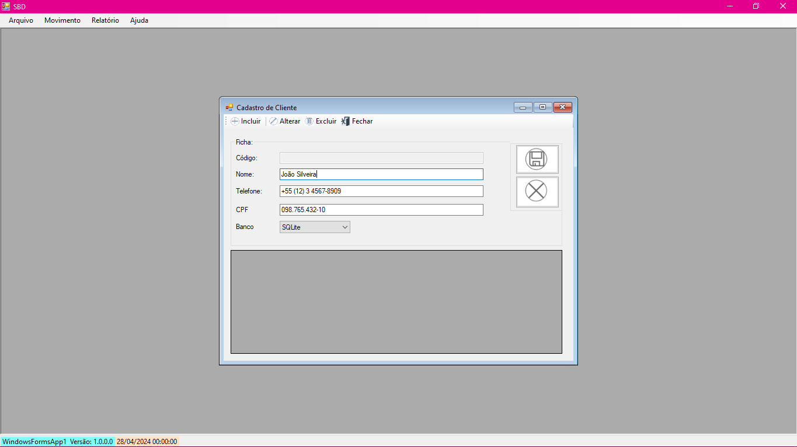
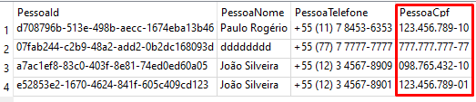

# 2024-04-26 - Atividade Presencial 

| PROF | ALUNO | RA |
|----------|----------|----------|
| ANTONIO ANDRADE   | IZAEL SILVA   | 922114939   |


## Acrescentar campo CPF no formulário de cliente e fazer todo processo até a gravação no Banco de Dados.

<br>



Fluxo para acrescentar o campo CPF tanto no visual do programa, como no banco de dados.

1. Adicionando a `Label | CPF` e a `Maskedtextbox | CPF` no `Form`
    
    * Label `label4`

      ```C#
        // 
        // label4
        // 
        this.label4.AutoSize = true;
        this.label4.Location = new System.Drawing.Point(7, 116);
        this.label4.Name = "label4";
        this.label4.Size = new System.Drawing.Size(27, 13);
        this.label4.TabIndex = 7;
        this.label4.Text = "CPF";
      ```
    * Maskedtextbox `mtxtCpf`
    
      ```C#
        // 
        // mtxtCpf
        // 
        this.mtxtCpf.Enabled = false;
        this.mtxtCpf.Location = new System.Drawing.Point(84, 113);
        this.mtxtCpf.Mask = "000\\.000\\.000-00";
        this.mtxtCpf.Name = "mtxtCpf";
        this.mtxtCpf.Size = new System.Drawing.Size(349, 20);
        this.mtxtCpf.TabIndex = 3;
      ```

---

<br>

2. Alterando a tabela `tb_Client` no bando de dados para acresncentar a coluna `CPF`.

    
  
    * No banco de dado `SQLServer`

      ```SQL
      ALTER TABLE tb_Client ADD PessoaCpf VARCHAR(14);
      ```
    * No banco de dado `SQLite`
      ```sql
      ALTER TABLE tb_client ADD PessoaCpf TEXT;
      ```

---

3. Alterando na `class Cadastro`

    `public string PessoaCpf { get; set; }`
    ```c#
    public const string strINSERT = "INSERT INTO tb_Client (PessoaId, PessoaNome, PessoaTelefone, `PessoaCpf`) " +
        "VALUES(@PessoaId, @PessoaNome, @PessoaTelefone, @PessoaCpf); ";
    ```
    

    * No metodo `public void GravarWithSQLite()` da `class Cadastro`

      `oCmd.Parameters.AddWithValue("@PessoaCpf", PessoaCpf);`

---

4. No formulário Cliente `public partial class FrmCliente : Form`

    * No metodo `TsbIncluir_Clic`

      `this.mtxtCpf.Enabled = true;`

    * No metodo `Limpar()`

      `this.mtxtCpf.Clear();`

    * No metodo `BtnGravar_Click`

      ```c#
        else if (String.IsNullOrEmpty(this.mtxtCpf.Text))
        {
          MessageBox.Show("Favor, preencha o campo CPF", "Atenção", MessageBoxButtons.OK, MessageBoxIcon.Warning);
          this.mtxtPhone.Focus();
          return;
        }
      ```
    * No metodo `BtnCancelar_Click`

      `this.mtxtPhone.Enabled = false;`