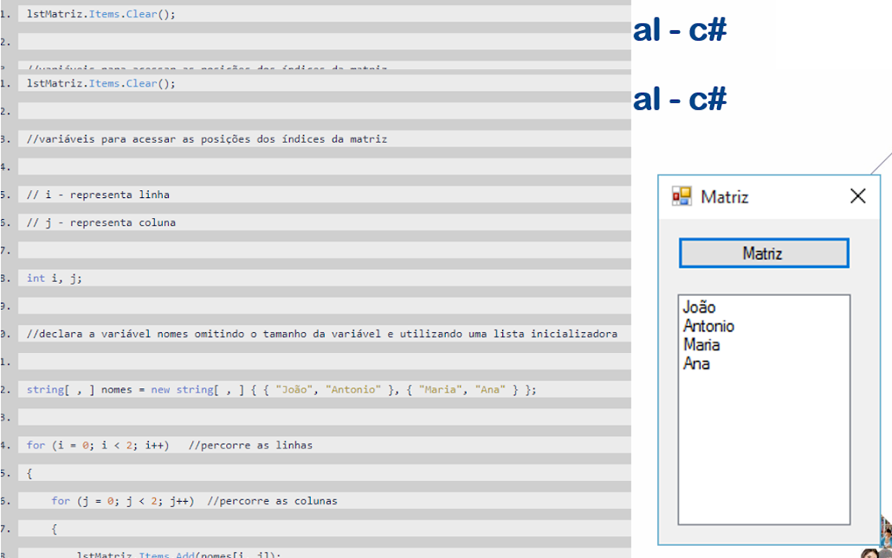
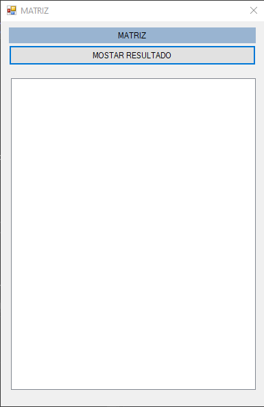
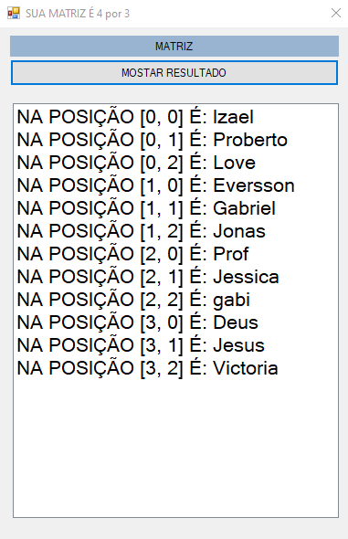

# 2024-04-12 - Atividade

| PROFº | ALUNO | RA |
|------|-------|--------|
| Antonio Andrade | IZAEL SILVA    | 922114939 |


### Atividade - Fazer este exemplo e outros no AAPA da mesma aula.



---

<br>
<br>

Este programa é um aplicativo Windows Forms escrito em C#, que exibe uma matriz de strings em uma ListBox quando o botão "BtnShow" é clicado.

Aqui está uma descrição do código:

- O programa começa com a declaração do namespace `System.Windows.Forms`, que contém classes para criar aplicativos Windows Forms.

- A classe `Form1` é definida e herda da classe `Form`, que é uma janela de formulário do Windows. Esta classe representa a janela principal do aplicativo.

- No construtor `Form1()`, `InitializeComponent()` é chamado para inicializar os componentes do formulário.

- O evento `BtnShow_Click` é acionado quando o botão "BtnShow" é clicado. Dentro deste evento:

  - `LbList.Items.Clear();` limpa qualquer item existente na ListBox `LbList`.

  - Uma matriz bidimensional de strings chamada `nomes` é criada e inicializada com valores de exemplo.

  - Dois loops `for` são usados para percorrer a matriz `nomes` e adicionar cada elemento à ListBox `LbList`. O texto adicionado consiste na posição do elemento na matriz seguido pelo valor do elemento.

  - Por fim, o título da janela (`this.Text`) é atualizado para exibir as dimensões da matriz.

Em resumo, este programa demonstra como criar e exibir uma matriz de strings em um aplicativo Windows Forms quando um botão é clicado.

<br>
<br>

```c#

  using System.Windows.Forms;

  namespace AULA_12_04_2024_MATRIZ
  {
      public partial class Form1 : Form
      {
          public Form1()
          {
              InitializeComponent();
          }

          private void BtnShow_Click(object sender, System.EventArgs e)
          {
              LbList.Items.Clear();

              string[,] nomes = new string[,] {
                  { "Izael", "Proberto", "Love"},
                  { "Eversson", "Gabriel", "Jonas"},
                  { "Prof", "Jessica", "gabi"},
                  { "Deus", "Jesus", "Victoria"}
              };

              for (int i = 0; i < nomes.GetLength(0); i++)
              {
                  for (int j = 0; j < nomes.GetLength(1); j++)
                  {
                      LbList.Items.Add("NA POSIÇÃO [" + i + ", " + j + "] É: " + nomes[i, j]);
                  }
              }

              this.Text = "SUA MATRIZ É " + nomes.GetLength(0).ToString() + " por " + nomes.GetLength(1).ToString();
          }
      }
  }

```

| TELA INICIAL | MOSTRANSO O RESULTADO |
|------|-------|
|  |     |

---

<br>
<br>

>Projeto [zipado](../AULA-12-04-2024-MATRIZ.rar)