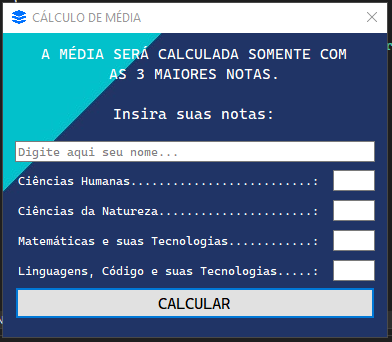
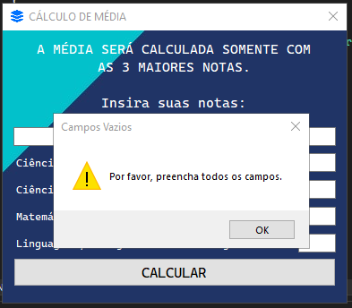
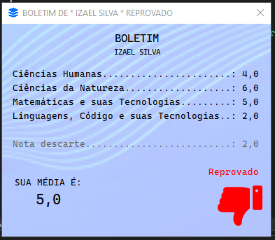

# 2024-03-22 - Atividade 4 Notas

### PROGRAMAÇÃO VISUAL
#### ANTONIO ANDRADE DOS SANTOS

---

 
 

Feito por
* *IZAEL ALVES DA SILVA - RA: 922114939*

---

 
 

##### PROJETO DE MÉDIA ARITMETICA, ONDE A PESSOA INSERE O NOME E QUATRO NOTAS, O SISTEMA VAI DESCARTAR A MENOR NOTA E TIRAR A MÉDIA DAS OUTRAS TRÊS.

 
 

* Projeto compactado em .ZIP
[Clique aqui](2024-03-22%20-%20Atividade%204%20Notas.zip)

---