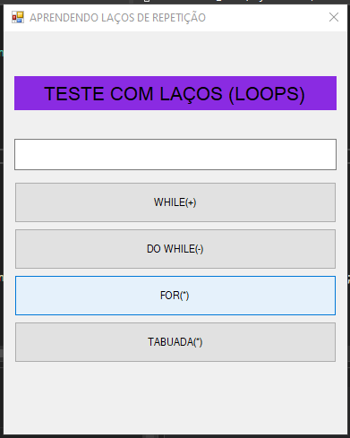
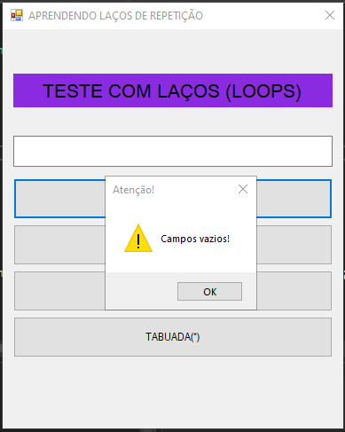
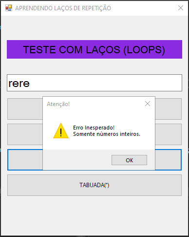
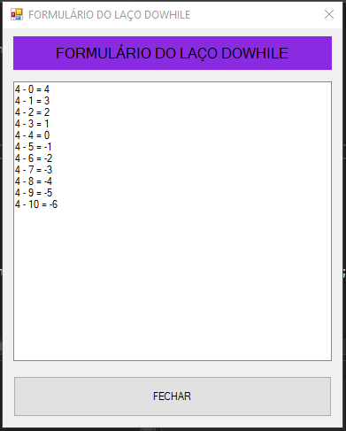
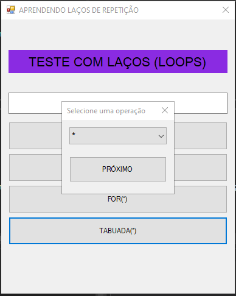
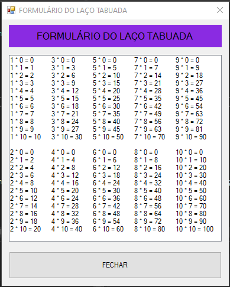

# 2024-04-05 - Atividade Presencial
> A atividade é implementar o código no botão de tabuada (btnTabuada), a exibição de todas as tabuadas (do 1 ao 10).

* Atualmente está exibindo somente a do 5. (postado na sessão "fontes").
<br>

| PROF | ALUNO | RA |
|----------|----------|----------|
| ANTONIO ANDRADE   | IZAEL SILVA   | 922114939   |
<br>


<br>

# FormMain
```c#

  using System;
  using System.Windows.Forms;

  namespace aula_05_04_2024_loops
  {
      public partial class Form1 : Form
      {
          private int n;

          public Form1()
          {
              InitializeComponent();
          }

          private void BtnDoWhile_Click(object sender, EventArgs e)
          {
              if (CheckFields().Equals("false"))
              {
                  frmResultado f = new frmResultado("DOWHILE", n);
                  f.ShowDialog();

                  txtNumber.Text = "";
              }
              else
              {
                  MessageBox.Show(CheckFields(), "Atenção!", MessageBoxButtons.OK, MessageBoxIcon.Warning);
                  txtNumber.Text = "";
                  txtNumber.Focus();
              }
          }

          private void BtnWhile_Click(object sender, EventArgs e)
          {
              if (CheckFields().Equals("false"))
              {
                  frmResultado f = new frmResultado("WHILE", n);
                  f.ShowDialog();

                  txtNumber.Text = "";
              }
              else
              {
                  MessageBox.Show(CheckFields(), "Atenção!", MessageBoxButtons.OK, MessageBoxIcon.Warning);
                  txtNumber.Text = "";
                  txtNumber.Focus();
              }
          }

          private void BtnFor_Click(object sender, EventArgs e)
          {
              if (CheckFields().Equals("false"))
              {
                  frmResultado f = new frmResultado("FOR", n);
                  f.ShowDialog();

                  txtNumber.Text = "";
              }
              else
              {
                  MessageBox.Show(CheckFields(), "Atenção!", MessageBoxButtons.OK, MessageBoxIcon.Warning);
                  txtNumber.Text = "";
                  txtNumber.Focus();
              }
          }

          private void BtnTabuada_Click(object sender, EventArgs e)
          {
              FrmOptions f = new FrmOptions("TABUADA");
              f.ShowDialog();
          }

          private string CheckFields()
          {
              string message;

              if (string.IsNullOrWhiteSpace(txtNumber.Text))
              {
                  message =  "Campos vazios!";
              }
              else
              {
                  try
                  {
                      n = int.Parse(txtNumber.Text);
                      message = "false";
                  }
                  catch
                  {
                      message = "Erro Inesperado!\nSomente nùmeros inteiros.";
                  }
              }

              return message;
          }
      }
  }

```

<br>
<br>
<br>

# frmResultado
```c#
  using System;
  using System.Collections.Generic;
  using System.ComponentModel;
  using System.Data;
  using System.Drawing;
  using System.Linq;
  using System.Text;
  using System.Threading.Tasks;
  using System.Windows.Forms;
  using System.Xml.Linq;

  namespace aula_05_04_2024_loops
  {
      public partial class frmResultado : Form
      {
          private readonly String _name;
          private readonly String _opt;
          private readonly int _n;
          private readonly String _description = "Formulário do laço ";

          public frmResultado(string name, int n)
          {
              InitializeComponent();
              
              this._n = n;
              this._name = name;

              Fields();
          }

          public frmResultado(string name, string opt)
          {
              InitializeComponent();

              this._name = name;
              this._opt = opt;

              Fields();
          }

          private void Fields()
          {
              this.Text = _description.ToUpper() + _name.ToUpper();
              this.lblRes.Text = _description.ToUpper() + _name.ToUpper();
          }

          private void BtnExit_Click(object sender, EventArgs e)
          {
              this.Close();
          }

          private void FrmResultado_Load(object sender, EventArgs e)
          {
              if (this._name.Equals("FOR"))
              {
                  for (int i = 0; i <= 10; i++)
                  {
                      int r = i * _n;
                      this.lbResult.Items.Add(_n.ToString() + " x " + i.ToString() + " = " + r.ToString());
                  }
              }

              if (this._name.Equals("WHILE"))
              {
                  int i = 0;

                  while (i <= 10)
                  {
                      int r = i + _n;
                      this.lbResult.Items.Add(_n.ToString() + " + " + i.ToString() + " = " + r.ToString());
                      i++;
                  }
              }

              if (this._name.Equals("DOWHILE"))
              {
                  int i = 0;
                  do
                  {
                      int r = _n - i;
                      this.lbResult.Items.Add(_n.ToString() + " - " + i.ToString() + " = " + r.ToString());
                      i++;
                  } while (i <= 10);
              }

              if (this._name.Equals("TABUADA"))
              {
                  int j = 1;

                  switch(_opt)
                  {
                      case "*":
                          while (j <= 10)
                          {
                              for (int i = 0; i <= 10; i++)
                              {
                                  int r = j * i;
                                  this.lbResult.Items.Add(j.ToString() + " * " + i.ToString() + " = " + r.ToString());
                              }

                              this.lbResult.Items.Add("");
                              j++;
                          }
                          break;
                      case "/":
                          j += 1;
                          while (j < 12)
                          {
                              for (int i = 1; i < 12; i++)
                              {
                                  float r = j / i;
                                  this.lbResult.Items.Add(j.ToString() + " / " + i.ToString() + " = " + r.ToString("0.0"));
                              }

                              this.lbResult.Items.Add("");
                              j++;
                          }
                          break;
                      case "+":
                          while (j <= 10)
                          {
                              for (int i = 0; i <= 10; i++)
                              {
                                  int r = j + i;
                                  this.lbResult.Items.Add(j.ToString() + " + " + i.ToString() + " = " + r.ToString());
                              }

                              this.lbResult.Items.Add("");
                              j++;
                          }
                          break;
                      case "-":
                          while (j <= 10)
                          {
                              for (int i = 0; i <= 10; i++)
                              {
                                  int r = j - i;
                                  this.lbResult.Items.Add(j.ToString() + " - " + i.ToString() + " = " + r.ToString());
                              }

                              this.lbResult.Items.Add("");
                              j++;
                          }
                          break;
                  }
              }
          }
      }
  }

```

<br>
<br>
<br>

# FrmOptions
```c#

  using System;
  using System.Windows.Forms;

  namespace aula_05_04_2024_loops
  {
      public partial class FrmOptions : Form
      {
          private readonly string _name;

          public FrmOptions(string name)
          {
              InitializeComponent();

              this._name = name;
              CbOptions.SelectedIndex = 2;
          }

          private void BtnNext_Click(object sender, System.EventArgs e)
          {
              string opt = CbOptions.SelectedItem as string;

              this.Close();

              frmResultado f = new frmResultado("TABUADA", opt);
              f.ShowDialog();

          }
      }
  }

```

---

<br>

### Arquivo zipado
[Clique aqui](aula_05_04_2024_loops.zip)

<br>
<br>






