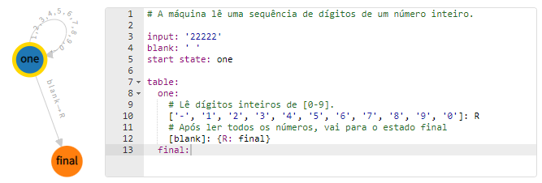

# ATIVIDADE

### 4 - Autômato - Hello World 

| DISCIPLINA  | LINGUAGENS FORMAIS E AUTOMATOS - TURMA 30 - MM  |
|-------------|-------------------------------------------------|
| PROFESSOR   | ROLFI CINTAS GOMES LUZ                          |
| ALUNO       | IZAEL ALVES DA SILVA                            |

<br>

---

<br>

### 1. Lê somente números inteiros (`INT`):


```py
# A máquina lê uma sequência de dígitos de um número inteiro.
input: '22222'
blank: ' '
start state: one

table:
  one:
    # Lê dígitos inteiros de [0-9].
    ['-', '1', '2', '3', '4', '5', '6', '7', '8', '9', '0']: R
    # Após ler todos os números, vai para o estado final
    [blank]: {R: final}
  final:
```
- **Explicação**: A máquina começa no estado `one`, lendo números de `0` a `9` ou o símbolo de menos (`-` para indicar números negativos). Quando encontra um espaço em branco (fim do número), vai para o estado final.

---

<br>

### 2. Máquina de Turing que lê `AAAbbbbbbbAAAAbbb` e sai ao encontrar 'c':

```py
# A máquina lê uma sequência específica de A's e b's e termina ao encontrar 'c'.

input: 'AAAbbbcbbbbAAAAbbb'
blank: ' '
start state: initial

table:
  initial:
    # Continua a ler enquanto encontrar 'A' ou 'b'
    ['A', 'b']: R
    # Ao encontrar 'c', vai para o estado final
    ['c']: {R: final}
  final:
```
- **Explicação**: A máquina lê uma sequência de 'A's e 'b's até encontrar o caractere 'c', que sinaliza o fim da execução.

---

<br>

### 3. Máquina de Turing que lê números `FLOAT` (ex.: `123456.32145`):

```py
# Esta máquina lê um número float, 
# ou seja, uma sequência de números inteiros
# seguidos por um ponto e mais números.

input: '123456.32145'
blank: ' '
start state: one

table:
  one:
    # Lê dígitos de um inteiro
    ['-','1','2','3','4','5','6','7','8','9']: R
    # Quando encontra um ponto, muda para o estado 'two'
    ['.']: {R: two}
  two:
    # Lê a parte decimal após o ponto
    ['0','1','2','3','4','5','6','7','8','9']: R
    # Após ler o número float, vai para o estado final
    [blank]: {R: final}
  final:
```
- **Explicação**: A máquina começa lendo números inteiros. Quando encontra o ponto decimal (`.`), muda para o estado `two`, onde lê a parte decimal.