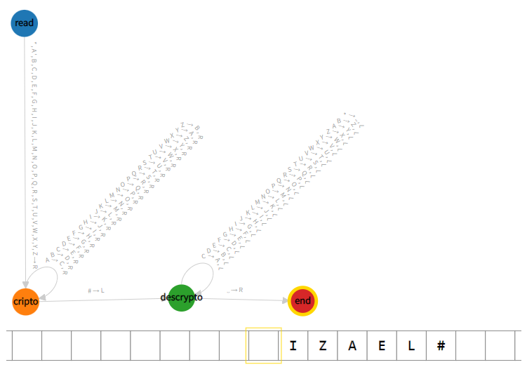

# ATIVIDADE

### 6 - Criptografia com Máquina de Turing

| DISCIPLINA  | LINGUAGENS FORMAIS E AUTOMATOS - TURMA 30 - MM  |
|-------------|-------------------------------------------------|
| PROFESSOR   | ROLFI CINTAS GOMES LUZ                          |
| ALUNO       | IZAEL ALVES DA SILVA                            |

<br>

---

<br>

### 1. Criptografia
- Trocar binario 0 para 1 e 1 para 0.
- ao ler # iniciar a descriptografia
  #### Descriptografia
  - trocando 0 para 1 e 1 para 0

```py

    input: '#1010'
    blank: ' '
    start state: leitura
    table:
      leitura:
      ['0','1','#']: R
      ['A','C']: R
      ' ': {L: cripto}
    
      cripto:
        '0': {write: '1', L}  
        '1': {write: '0', L}  
        '#': {R: descripto}
        'A': {write: 'C', L}  

      descripto:
        '0': {write: '1', R}  
        '1': {write: '0', R}
        'C': {write: 'A', R}

```

---

<br>

### 2. Melhorando a sequência, envie segunda foto acrescentando a CIFRA DE CESAR.

```py
input: '*IZAEL#'
blank: ' '
start state: read

table:
  read:
    ['*',A','B','C','D','E','F','G','H','I','J','K','L','M','N','O','P','Q','R','S','T','U','V','W','X','Y','Z']: {R: cripto}
  cripto:
    ['A']: {write: "C", R}
    ['B']: {write: "D", R}
    ['C']: {write: "E", R}
    ['D']: {write: "F", R}
    ['E']: {write: "G", R}
    ['F']: {write: "H", R}
    ['G']: {write: "I", R}
    ['H']: {write: "J", R}
    ['I']: {write: "K", R}
    ['J']: {write: "L", R}
    ['K']: {write: "M", R}
    ['L']: {write: "N", R}
    ['M']: {write: "O", R}
    ['N']: {write: "P", R}
    ['O']: {write: "Q", R}
    ['P']: {write: "R", R}
    ['Q']: {write: "S", R}
    ['R']: {write: "T", R}
    ['S']: {write: "U", R}
    ['T']: {write: "V", R}
    ['U']: {write: "W", R}
    ['V']: {write: "X", R}
    ['W']: {write: "Y", R}
    ['X']: {write: "Z", R}
    ['Y']: {write: "A", R}
    ['Z']: {write: "B", R}
    ['#']: {L: descrypto}
  descrypto:
    ['C']: {write: "A", L}
    ['D']: {write: "B", L} 
    ['E']: {write: "C", L} 
    ['F']: {write: "D", L} 
    ['G']: {write: "E", L} 
    ['H']: {write: "F", L} 
    ['I']: {write: "G", L} 
    ['J']: {write: "H", L} 
    ['K']: {write: "I", L} 
    ['L']: {write: "J", L} 
    ['M']: {write: "K", L} 
    ['N']: {write: "L", L} 
    ['O']: {write: "M", L} 
    ['P']: {write: "N", L} 
    ['Q']: {write: "O", L} 
    ['R']: {write: "P", L} 
    ['S']: {write: "Q", L} 
    ['T']: {write: "R", L} 
    ['U']: {write: "S", L} 
    ['V']: {write: "T", L} 
    ['W']: {write: "U", L} 
    ['X']: {write: "V", L} 
    ['Y']: {write: "W", L} 
    ['Z']: {write: "X", L} 
    ['A']: {write: "Y", L} 
    ['B']: {write: "Z", L}
    ['*']: {write: " ", L}
    [' ']: {R: end}
  end:
```

