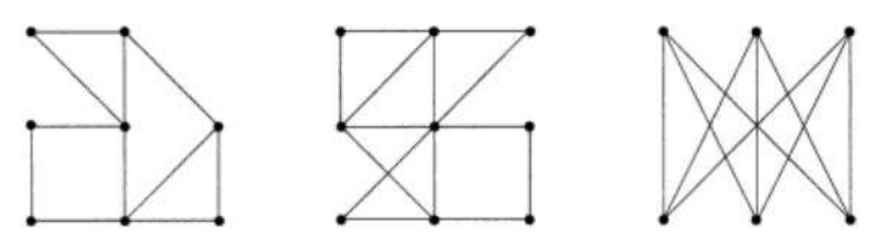

## ATIVIDADES | AVA UNI9

#### TEORIA DOS GRAFOS E COMPLEXIDADE

#### Avaliação 2 - Teoria dos Grafos e Complexidade | Mútipla Escolha

| RA          | 922114939               |
|:----------- |:----------------------- |
| NOME        | IZAEL ALVES DA SILVA    |
| CURSO       | CIÊNCIA DA COMPUTAÇÃO   |
| SÉRIE/TURMA | 06/30                   |
| ANO         | 2024/02                 |
| CAMPUS      | MEMORIAL AMÉRICA LATINA |

### QUESTÃO 1 DE 5
**Analise as afirmações abaixo e assinale a alternativa que represente um grafo regular de grau 3 com 6 vértices.**
> - [X] O grafo é bipartido, tem nove arestas e tem um caminho Hamiltoniano
- [ ] O grafo não é bipartido, tem nove arestas e tem um caminho Hamiltoniano
- [ ] O grafo é bipartido, tem oito arestas e tem um caminho Euleriano
- [ ] O grafo não é bipartido, tem oito arestas e tem um caminho Hamiltoniano
- [ ] O grafo é bipartido, tem nove arestas e tem um caminho Euleriano

---

 

### QUESTÃO 2 DE 5
**Analise as afirmações abaixo e assinale a alternativa que represente um grafo de graus 2,2,2,2,2,4,4,4,6.**
- [ ] O grafo tem 9 vértices, 15 arestas, é Euleriano mas não é Hamiltoniano.
- [ ] O grafo tem 9 vértices, 14 arestas, não é Euleriano e Hamiltoniano.
> - [X] O grafo tem 9 vértices, 14 arestas, é Euleriano mas não é Hamiltoniano.
- [ ] O grafo tem 9 vértices, 15 arestas, é Euleriano e Hamiltoniano.
- [ ] O grafo tem 9 vértices, 14 arestas, é Euleriano e Hamiltoniano.

---

 

### QUESTÃO 3 DE 5
**Analise as afirmações abaixo e assinale a alternativa CORRETA.**
1. Um grafo de graus 2,2,2,2,2,4,4,4,6, tem 14 arestas e é Euleriano mas não é Hamiltoniano.
2. Um grafo regular de grau 3 com 6 vértices, é bipartido, tem nove arestas e tem um caminho Hamiltoniano
3. Existe um grafo simples com cinco vértices, o qual têm os seguintes graus 1,2,3,4,5
4. Grafo é uma tripla, G(N, A, g) onde N é um conjunto de vértices, A é um conjunto de arestas e g é uma função que associa dada aresta a um par de vértices (x,y) que representam os extremos dessa aresta.
5. V. Um grafo regular de grau 4 com 10 arestas tem 5 vértices.
- [] Somente as alternativas II, III, IV e V estão corretas
- [ ] Somente as alternativas I, II e IV estão corretas
- [ ] Somente as alternativas I, III, IV e V estão corretas
- [ ] Somente as alternativas I, III e IV estão corretas
> - [X] Somente as alternativas I, II, IV e V estão corretas

---

 

### QUESTÃO 4 DE 5
**Analise as afirmações abaixo e assinale a alternativa CORRETA.**
1. O número de arestas de um grafo com vértices de graus 5; 2; 2; 2; 2; 1 é 7
2. O número de arestas de um grafo com vértices de graus 5; 2; 2; 2; 2; 1 é 6
3. Um grafo regular de grau 4 com 10 arestas, apresenta 11 vértices.
4. O problema das pontes de Königsberg não tem solução
5. Para se obter uma solução para o problema das pontes de Könisgsberg, é necessário derrubar algumas pontes ou serem construído novas. Por exemplo, poderiam ser derrubadas uma de cada ponte dupla e a entre as duas ilhas. Outra solução seria ligar a segunda ilha também com duas pontes com cada margem.
- [ ] Somente as alternativas II, III e V estão corretas
- [ ] Somente as alternativas II, IV e V estão corretas 
- [ ] Somente as alternativas III, IV e V estão corretas 
> - [X] Somente as alternativas I, IV e V estão corretas
- [ ] Somente as alternativas II, III e IV estão corretas 

---

 

### QUESTÃO 5 DE 5
**Analise os grafos em anexo e assinale a alternativa correta**

> - [X] O grafo 1 é Euleriano e Hamiltoniano O grafo 2 é Euleriano e não é Hamiltoniano O grafo 3 não é Euleriano e é Hamiltoniano.
- [ ] O grafo 1 é Euleriano e Hamiltoniano O grafo 2 é Euleriano é Hamiltoniano O grafo 3 não é Euleriano e é Hamiltoniano.
- [ ] O grafo 1 não é Euleriano e Hamiltoniano O grafo 2 é Euleriano e não é Hamiltoniano O grafo 3 não é Euleriano e é Hamiltoniano.
- [ ] O grafo 1 é Euleriano e Hamiltoniano O grafo 2 é Euleriano e não é Hamiltoniano O grafo 3 é Euleriano e é Hamiltoniano.
- [ ] O grafo 1 é Euleriano e não é Hamiltoniano O grafo 2 é Euleriano e não é Hamiltoniano O grafo 3 não é Euleriano e é Hamiltoniano.

 
 

---

    © 2024 | Feito com 💟 por
    <a href="https://www.linkedin.com/in/izaelsilva" target="_blank">Silva, Izael A.</a>

