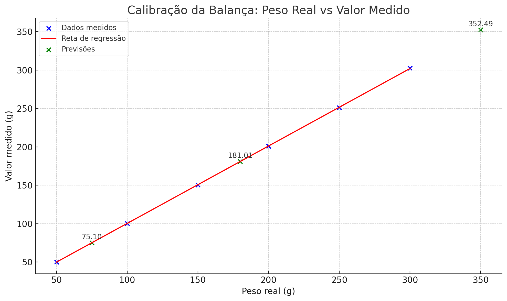

# ATIVIDADE: MMQ - APLICAÇÃO DE REGRESSÃO LINEAR

| DISCIPLINA  | METODOS NUMERICOS COMPUTACIONAIS - TURMA 48 - MM  |
|-------------|-------------------------------------------------|
| PROFESSOR   | DEBORA VIRGILIA CANNE                          |
| ALUNO       | IZAEL ALVES DA SILVA                            |

 

### 01 - Suponha que você é um analista de dados de uma empresa de comércio eletrônico que está estudando o comportamento de compra dos seus clientes. Você coletou dados de 20 clientes, medindo duas variáveis: o tempo que eles gastaram navegando no site (em minutos) e o valor total de suas compras (em reais). Você deseja descobrir se há uma relação linear entre essas duas variáveis e, em caso afirmativo, qual é a equação da linha que melhor se ajusta aos dados.

Usando o método de mínimos quadrados, determine a equação da reta de regressão linear que melhor descreve essa relação e interprete os resultados.

Dados:

- *Tempo navegação* = [5, 10, 12, 20, 22, 28, 35, 40, 45, 50, 55, 60, 70, 80, 85, 90, 95, 100, 110, 120]
- *Valor compra* = [30, 50, 60, 100, 110, 150, 190, 200, 240, 260, 290, 310, 360, 420, 440, 480, 500, 520, 560, 600]

1. > Exibir a reta de regressão.

    O gráfico abaixo exibe:

    Os pontos reais (azul). A reta de regressão (vermelha). E os valores previstos para 25, 75 e 105 minutos (verde).

    Reta de Regressão Corrigida:

    Inclinação (b): `5,137`

    Intercepto (a): `2,729`

    A equação correta é: `y = 2,729 + 5,137x`

​

2. > Analise o valor da correlação (r).
  
  - O coeficiente de correlação de Pearson mede a intensidade e direção da relação linear entre as variáveis:

    r ≈ 0,999

    Há uma forte correlação positiva quase perfeita entre o tempo de navegação e o valor da compra. Quanto mais tempo no site, maior tende a ser o valor da compra.

3. > Faça alguns testes de previsão.

    Para 25 minutos de navegação: `y = 2,729 + 5,137 * 25 = R$131,16`

    Para 75 minutos de navegação: `y = 2,729 + 5,137 * 75 = R$388,03`

    Para 105 minutos de navegação: `y = 2,729 + 5,137 * 105 = R$542,15`

---

 

### 02 - Suponha que você tenha uma balança e queira calibrá-la para que ela possa ser usada com precisão em experimentos futuros. Para fazer isso, você pode usar MMQ para encontrar a relação entre os pesos reais e os valores medidos pela balança.

Aqui está um exemplo de tabela de valores 

| PESO (G) | VALOR MEDIDO (G)       |
|---|---------|
| 50 | 50,1     |
| 100 | 100,3     |
| 150 | 150,6 |
| 200| 201,1  |
| 250 | 251,2 |
| 300 | 302,5 |

Nesse problema, o peso real é a variável independente, enquanto o valor medido é a variável dependente. Para aplicar MMQ, você precisa encontrar a equação da reta que melhor descreve a relação entre essas duas variáveis.
Faça uma análise do resultado. Testar outros valores para previsão.

  - Reta de regressão (`medido = a + b * pesoReal`):
          
    Inclinação (b): `1,007`

    Intercepto (a): `-0,146`

    Equação da reta: `ValorMedido = −0,146 + 1,007 * pesoReal`

  - Análise:

    A inclinação próxima de 1 mostra que a balança está bem calibrada.

    O intercepto é muito próximo de 0, o que é ideal.

    Pequena tendência de superestimar o peso em aproximadamente 0,7%.

  - Previsão com a equação:
  
    Para um peso de 180g: `−0,146 + 1,007 * 180` aproximadamente `181,11g`
    
    Para um peso de 350g: `−0,146 + 1,007 * 350` aproximadamente `352,3g`