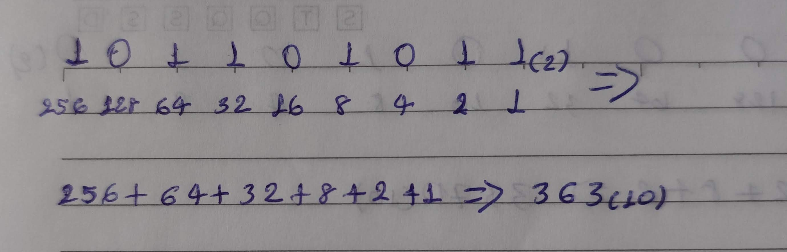
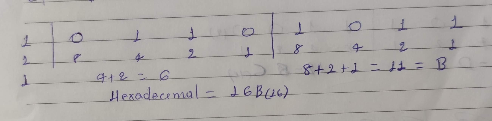
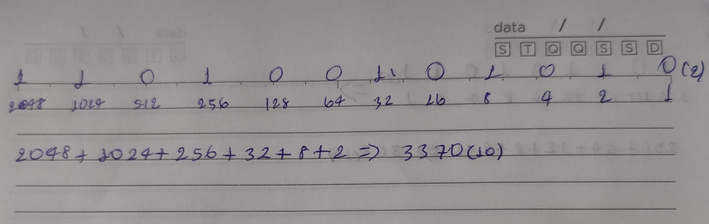
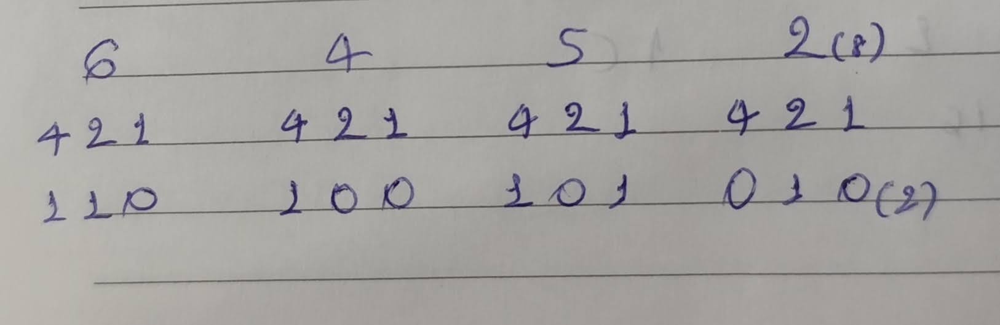
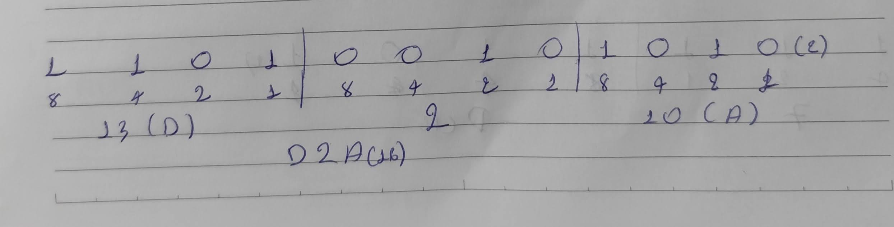
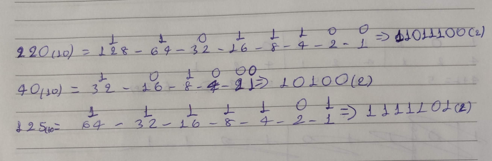
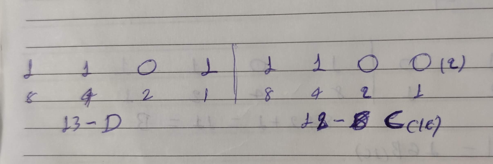
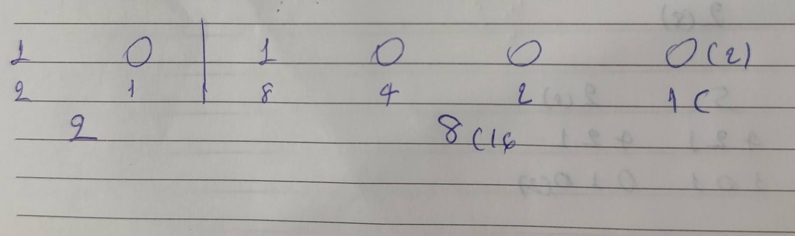
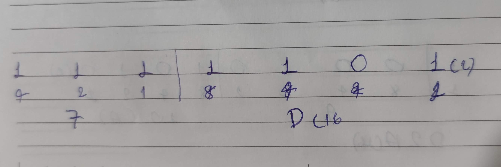

# ATIVIDADE: BASES NUMÉRICAS

| DISCIPLINA  | METODOS NUMERICOS COMPUTACIONAIS - TURMA 48 - MM  |
|-------------|-------------------------------------------------|
| PROFESSOR   | DEBORA VIRGILIA CANNE                          |
| ALUNO       | IZAEL ALVES DA SILVA                            |

 

---

 

1. Desafio das Placas Veiculares. Um novo sistema de placas de veículos utiliza um código numérico que precisa ser armazenado de forma eficiente. Um veículo foi registrado com o código decimal 2025.
- Converta esse número para binário.

    |1|1|1|1|1|1|0|1|0|0|1
    |--|--|---|---|---|---|---|---|---|---|---|
    |**1024**|**512**|**256**|**128**|**64**|**32**|16|**8**|4|2|**1**|

> **2025 na base (10) equivale à `11111101001` na base (2).**
    
- Converta esse número para octal.
    |2|1|-|4|2|1|-|4|2|1|-|4|2|1|(calc.)|
    |--|--|---|---|---|---|---|---|---|---|---|---|---|----|--|
    |1|1|-|1|1|1|-|1|0|1|-|0|0|1|(2)|
    |**3**|||**7**||||**5**| || |**1**|||(8)|

> **2025 na base (10) equivale à `3751` na base (8).**

- Converta esse número para hexadecimal.
    |4|2|1|-|8|4|2|1|-|8|4|2|1|(calc.)|
    |--|--|---|---|---|---|---|---|---|---|---|---|---|----|
    |1|1|1|-|1|1|1|0|-|1|0|0|1|(2)|
    |**7**||||**E**|||||**9**| |||(16)|

> **2025 na base (10) equivale à `7E9` na base (16).**

---

2. Código de Erros no Servidor. Um servidor de uma empresa de tecnologia retorna códigos de erro em diferentes bases numéricas. O código hexadecimal de um erro crítico foi "3F2".
- Converta esse código para decimal.
    - 3F2(16) = 3×16² + F×16¹ + 2×16°
    - 3F2(16) = 3×256 + 15×16 + 2
    - 3F2(16) = 768 + 240 + 2 = 1010(10)

> **3F2 na base (16) equivale à `1010` na base (10).**

- Converta esse código para binário.
3 = 0011 (2)
𝐹 = 1111 (2)
2 = 0010 (2)

> **R: 001111110010 (2)**

- Converta esse código para octal.

    - 111110010 (2) = 372 (8) (agrupar em trios da direita para a esquerda)
> **R: 3𝐹2 (16) = 372 (8)**

---

3. Pacotes de Dados em Redes. Em redes de computadores, pacotes de dados podem conter identificadores representados em bases numéricas distintas. Um roteador recebeu um pacote identificado pelo número 101101011 em binário.
- Converta esse número para decimal.
    

- Converta esse número para octal.
    

- Converta esse número para hexadecimal.
    

- Explique qual dessas representações seria mais compacta e útil para programadores e administradores de redes.
> R: Hexadecimal (16) é geralmente a melhor escolha para programadores e administradores de redes. Ele oferece uma forma mais curta de representar números binários, reduzindo o número de caracteres necessários

---

4. Endereçamento de Memória. Um sistema embarcado armazena informações em endereços representados em octal. O endereço de um dado crítico é 6452 (octal).
- Converta esse número para decimal.
    

- Converta esse número para binário.
    

- Converta esse número para hexadecimal.
    

- Depois, explique como o uso de octal e hexadecimal pode facilitar a leitura e escrita de endereços de memória em sistemas embarcados.
> O uso de bases numéricas mais compactas facilita a leitura e escrita de endereços. Porque em sistemas embarcados, o armazenamento de memória é organizado em palavras de 8, 16 ou 32 bits.

---

5. Cores na Programação de Jogos. No desenvolvimento de jogos, as cores podem ser representadas no formato hexadecimal RGB. Suponha que uma cor tem os valores R = 220, G = 40, B = 125 em decimal (220,40,125).
- Converta cada valor para binário.
    

- Converta cada valor para hexadecimal.
    
    
    
- Depois, escreva a cor final no formato hexadecimal RGB, como seria usada em código (por exemplo, #DC287D).
> R: #DC287D

