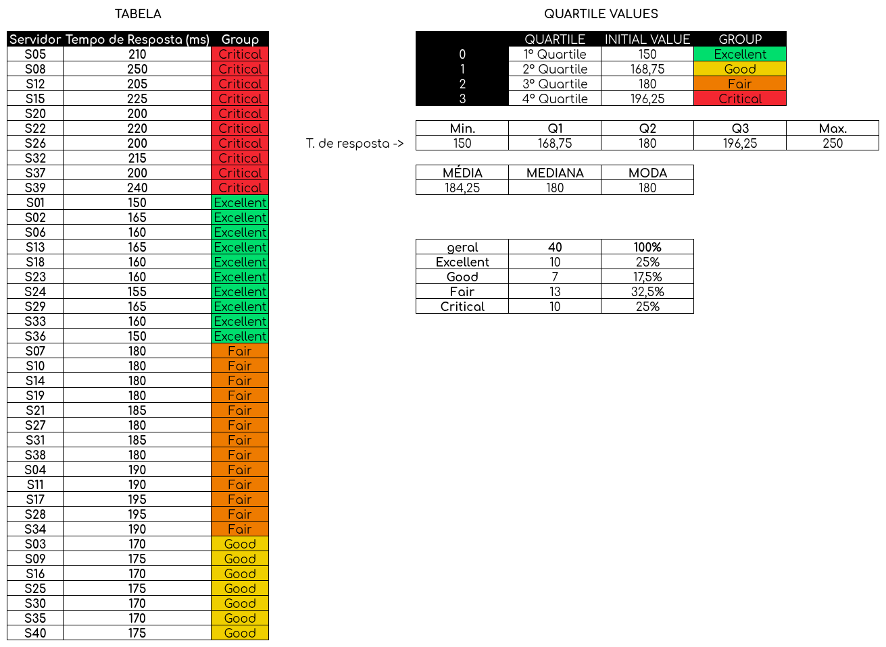

# ATIVIDADE | MEDIDAS SEPARATRIZES

|   ALUNO       |   IZAEL ALVES DA SILVA   |
|:---------------|:--------------------------|
|   PROFESSOR    |   DEBORA VIRGÍLIA CANNE          |
|   DISCIPLINA  |   ANÁLISE DE DADOS |


<br>

#### 1. FAZER OS CALCULOS: MEDIA, MEDIANA, MODA. QUARTIS CATEGORIZAR EM 4 GRUPOS FAZER ANALISE DOS DADOS




### 🧮 **1. Dados Fornecidos (Tempo de Resposta em ms)**

```
150, 165, 170, 190, 210, 160, 180, 250, 175, 180,
190, 205, 165, 180, 175, 170, 195, 180, 180, 200,
185, 220, 160, 155, 175, 200, 180, 165, 195, 170,
185, 215, 160, 190, 170, 150, 200, 195, 240, 175
```
---

### 📊 **2. Cálculos Estatísticos**

### 🔹 **Média (Mean)**

`Média = soma do valores / númeoros de observações = 7370/40 = 184,25`

**→ Média = 184,25 ms**


### 🔹 **Mediana (Median)**

A mediana é o valor central quando os dados estão em ordem crescente.

Ordenando os 40 valores:
150, 150, 155, 160, 160, 160, 160, 165, 165, 165, 170, 170, 170, 170, 175, 175, 175, 175, 180, 180, 180, 180, 180, 185, 185, 190, 190, 190, 195, 195, 195, 200, 200, 200, 205, 210, 215, 220, 240, 250

Como são **40 dados**, a mediana é a média entre o 20º e o 21º valor: `Mediana = (180 + 180) / 2 = 180`

**→ Mediana = 180 ms**


### 🔹 **Moda (Mode)**

É o valor que mais se repete.

→ O valor **180 ms** aparece **5 vezes**, sendo o mais frequente.

**→ Moda = 180 ms**

---

### 🧩 **3. Quartis (Valores Separatrizes)**

| Medida                 | Valor (ms) | Interpretação                     |
| ---------------------- | ---------- | --------------------------------- |
| **Q1 (25%)**           | 168,75     | Limite superior dos melhores 25%  |
| **Q2 (50%) = Mediana** | 180        | Valor central dos dados           |
| **Q3 (75%)**           | 196,25     | Limite superior dos 75% dos dados |
| **Mínimo**             | 150        | Melhor tempo (mais rápido)        |
| **Máximo**             | 250        | Pior tempo (mais lento)           |

---

### 🧱 **4. Categorização em 4 Grupos**

Com base nos quartis:

| Grupo            | Intervalo de Tempo (ms) | Qtde | %     | Interpretação                   |
| ---------------- | ----------------------- | ---- | ----- | ------------------------------- |
| 🟩 **Excellent** | ≤ 168,75                | 10   | 25%   | Servidores com ótimo desempenho |
| 🟨 **Good**      | 168,76 – 180            | 7    | 17,5% | Desempenho satisfatório         |
| 🟧 **Fair**      | 180,01 – 196,25         | 13   | 32,5% | Desempenho mediano              |
| 🟥 **Critical**  | > 196,25                | 10   | 25%   | Desempenho crítico (lento)      |

---

### 📈 **5. Análise e Interpretação**

### 🧠 **a) Tendências gerais**

* A **média (184,25)** e a **mediana (180)** estão próximas, indicando que os dados são **ligeiramente assimétricos à direita** (há poucos servidores com tempos muito altos).
* A **moda (180)** confirma que este é o tempo de resposta mais comum entre os servidores.

### ⚙️ **b) Desempenho por grupos**

* **Excelente (25%)**: servidores com performance **ótima**, tempos abaixo de 168,75 ms.
* **Good (17,5%)**: ainda eficientes, mas próximos da média geral.
* **Fair (32,5%)**: indicam **queda de eficiência**, precisam de manutenção preventiva.
* **Critical (25%)**: representam **lentidão crítica** — devem ser priorizados para ajustes.

### 🔍 **c) Conclusão**

O conjunto mostra que **42,5% (Excellent + Good)** dos servidores apresentam tempos satisfatórios, enquanto **57,5% (Fair + Critical)** estão **abaixo do esperado**.
A infraestrutura precisa de **otimização**, redistribuição de carga e verificação de gargalos nos servidores mais lentos (>196,25 ms).

---

### 📘 **6. Conclusão Geral**

* **Média:** 184,25 ms
* **Mediana:** 180 ms
* **Moda:** 180 ms
* **Quartis:** Q1 = 168,75 | Q2 = 180 | Q3 = 196,25
* **Desempenho bom ou excelente:** 42,5%
* **Desempenho mediano ou crítico:** 57,5%

🟢 Há servidores com excelente tempo de resposta.
🔴 Mas a maioria ainda apresenta lentidão moderada a severa, exigindo atenção técnica.

<br>

[Link da Planilha google](https://docs.google.com/spreadsheets/d/1WlpwIowZiJteex-JagJ3khqgVR4bxl9d/edit?usp=sharing&ouid=109787904884700197957&rtpof=true&sd=true)


<br>
<br>
<br>
<br>
<br>

<div align="center">
   👋 Feito com ♥ by Izael Silva 👋
</div>