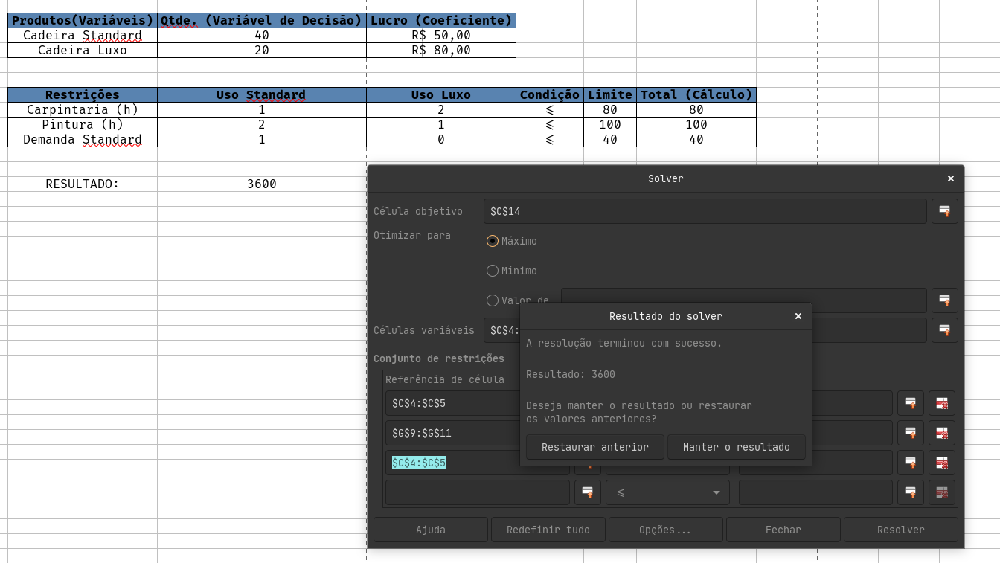

# AV1 | Exercicio de Maximização de Lucro

|   ALUNO       |   IZAEL ALVES DA SILVA   |
|:---------------|:--------------------------|
|   PROFESSOR    |   JOAO VAGNER PEREIRA DA SILVA          |
|   DISCIPLINA  |   PESQUISA OPERACIONAL |

 

> ### Exercicio de Maximização de Lucro (com recursos limitados) e Minimização de Custo (com requisitos mínimos) - SOLVER

Resolva pela PLnilha da Google ou pelo excell os exercicio de Maximização de Lucro (com recursos limitados) e Minimização de Custo (com requisitos mínimos)

PELO METODO SOLVER.

Vc tem que entregar o equacionamento do problema ( modelagem matematica) e o print das telas das planilhas, inclua os print de preenchimento das Macros/questionario do solver. ( veja imagem anexa)

---

### Problema 01:
**Maximização de Produção (Mix de Produtos)**

**Contexto:**

Uma pequena fábrica de móveis produz dois modelos de cadeiras: a **Standard** e a **Luxo**. A fábrica precisa decidir quantas unidades de cada modelo produzir para maximizar o lucro semanal, respeitando as limitações de horas de carpintaria e pintura disponíveis.

**Dados:**

- **Lucro por unidade:** Standard (R$ 50,00), Luxo (R$ 80,00).
- **Carpintaria:** A Standard gasta 1 hora; a Luxo gasta 2 horas. Disponibilidade total: **80 horas.**
- **Pintura:** A Standard gasta 2 horas; a Luxo gasta 1 hora. Disponibilidade **total:** **100 horas.**
- **Demanda:** O marketing diz que não adianta produzir mais de 40 cadeiras Standard, pois o mercado não absorve.

 
 

> SOLUÇÂO

**Variáveis de decisão**

(x1) = número de cadeiras **Standard**

(x2) = número de cadeiras **Luxo**

**Função objetivo**
Maximizar o lucro semanal:

$
\text{Max } Z = 50x_1 + 80x_2
$

**Restrições**

$
\begin{aligned}
1x_1 + 2x_2 &\le 80 &\text{(horas carpintaria)}\\
2x_1 + 1x_2 &\le 100 &\text{(horas pintura)}\\
x_1 &\le 40 &\text{(demanda máxima Standard)}\\
x_1, x_2 &\ge 0
\end{aligned}
$

**Resultado (Solver)**

**Interpretação:** A produção atinge o limite de demanda de Standard (40) e usa as horas remanescentes para produzir 20 unidades Luxo. Com essas quantidades, as restrições de carpintaria e pintura ficam satisfeitas.

---

### Problema 02:
**Minimização de Custos (Problema da Mistura/Dieta)**

**Contexto:**

Uma agroindústria precisa produzir uma tonelada de ração animal misturando dois ingredientes básicos: **Milho** e **Soja**. A mistura final deve atender a requisitos nutricionais mínimos de Proteína e Vitaminas, ao menor custo possível.

**Dados:**

- **Custo por kg:** Milho (R$ 0,40), Soja (R$ 0,90).
- **Proteína**: Milho tem 8%; Soja tem 40%. Requisito mínimo na mistura: **18%.**
- **Vitaminas**: Milho tem 6 unidades/kg; Soja tem 2 unidades/kg. Requisito mínimo na mistura: **4 unidades/kg.**
- **Quantidade Total**: A soma dos ingredientes deve ser igual a 1000 kg.

 
 

> SOLUÇÃO

**Variáveis de decisão**
- (m) = kg de **Milho**
- (s) = kg de **Soja**

**Função objetivo**
Minimizar custo total:
$
\text{Min } C = 0{,}40,m + 0{,}90,s
$

**Restrições**

$
\begin{aligned}
m + s &= 1000 &&\text{(kg total)}\\
0.08\,m + 0.40\,s &\ge 180 &&\text{(proteína total)}\text{(18 - 1000 kg = 180 kg)}\\
6\,m + 2\,s &\ge 4000 &&\text{(vitaminas totais; 4 un/kg × 1000 kg = 4000 un)}\\
m, s &\ge 0
\end{aligned}
$

**Observação sobre unidades:** usei unidades totais (kg e unidades) para evitar confusão entre porcentagens e massa (erro comum).

**Resultado (Solver / cálculo)**

**Interpretação:** A solução privilegia milho (mais barato e com muita vitamina), até o ponto em que a restrição de proteína fica exatamente satisfeita (binding). A restrição de vitaminas não fica limitante porque o milho já traz vitaminas em excesso.

---

## 5. Conclusão

* Problema 01: solução correta — produzir 40 Standard e 20 Luxo maximiza o lucro (R$3.600).
* Problema 02: solução correta — mistura com 687,5 kg milho e 312,5 kg soja minimiza custo (R$556,25), atendendo proteínas e vitaminas.

    
    
    
    
   

   👋 Feito com ❤️ by Izael Silva 👋

