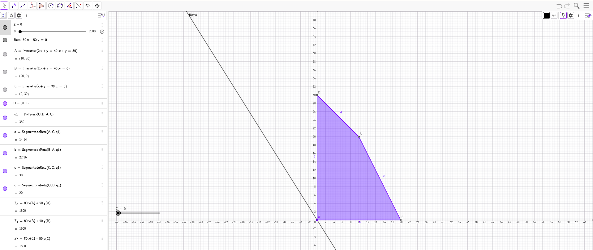
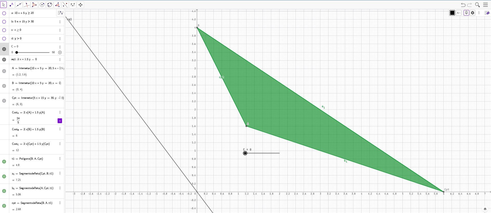
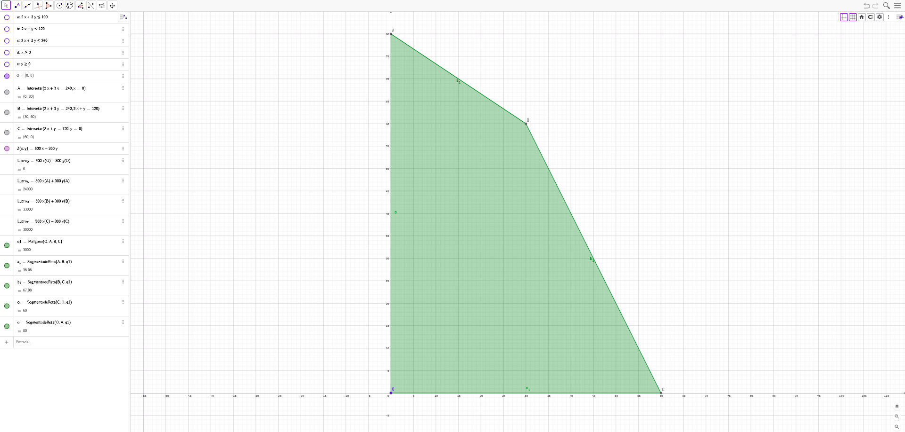

# Exercício

### Maximização e minimização por modo gráfico

 

|   ALUNO       |   IZAEL ALVES DA SILVA   |
|:---------------|:--------------------------|
|   PROFESSOR    |   JOÃO VAGNER PEREIRA DA SILVA         |
|   DISCIPLINA  |   PESQUISA OPERACIONAL |

 

### Equacionado os exercícios anteriores mostrar a solução pelo modo gráfico no Geogebra

> ### Exercício 1: Maximização de Lucro na Produção de Móveis
Uma pequena marcenaria produz dois tipos de móveis: **mesas** e **cadeiras**. A produção de uma mesa consome 2 horas de mão de obra e 1 unidade de
madeira, gerando um lucro de R$ 80,00. A produção de uma cadeira consome 1 hora de mão de obra e 1 unidade de madeira, com um lucro de R$ 50,00. A marcenaria dispõe de um total de 40 horas de mão de obra e 30 unidades de madeira por semana. O objetivo é determinar quantas mesas e cadeiras devem ser produzidas semanalmente para maximizar o lucro total.

A solução ótima é produzir 10 mesas (x) e 20 cadeiras (y), gerando um lucro máximo de R$ 1.800,00.

---

> ### Exercício 2: Minimização de Custos em uma Dieta
Um nutricionista está elaborando uma dieta com base em dois alimentos, A e B. Cada 100g do alimento A contém 10g de proteína e 5g de carboidratos, custando R$ 2,00. Cada 100g do alimento B contém 5g de proteína e 15g de carboidratos, custando R$ 1,50. A dieta precisa ter no mínimo 20g de proteína e 30g de carboidratos por dia. O objetivo é determinar a quantidade de cada alimento que deve ser consumida para satisfazer as necessidades nutricionais com o menor custo possível.

A solução ótima é consumir 120g do alimento A (x=1.2) e 160g do alimento B (y=1.6), para um custo diário mínimo de R$ 4,80.

---

> ### Exercício 3: Maximização de Produção Agrícola
Um agricultor tem 100 hectares de terra para plantar milho e soja. O custo de plantio por hectare de milho é de R$ 200,00 e o de soja é R$ 100,00. O agricultor tem um orçamento máximo de R$ 12.000,00 para o plantio. A mão de obra necessária para o milho é de 2 dias por hectare e para a soja é de
3 dias por hectare. O agricultor dispõe de no máximo 240 dias de mão de obra. O lucro por hectare de milho é de R$ 500,00 e de soja é R$ 300,00. O objetivo é determinar quantos hectares de cada cultura devem ser plantados para maximizar o lucro.

A solução ótima é plantar 30 hectares de milho (x) e 60 hectares de soja (y), alcançando um lucro máximo de R$ 33.000,00.

---

 
 
 
 
 

   👋 Feito com ♥ by Izael Silva 👋

