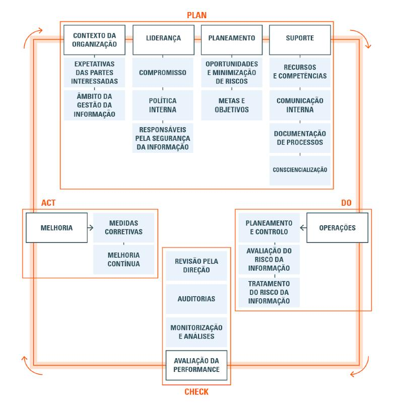

# ATIVIDADE | PDCA

### CICLO PDCA

|   ALUNO       |   IZAEL ALVES DA SILVA   |
|:---------------|:--------------------------|
|   PROFESSOR    |   JOAO RAFAEL GONCALVES EVANGELISTA          |
|   DISCIPLINA  |   SEGURANÇA DA INFORMAÇÃO |

---

 

### ISO 27001 e o Ciclo PDCA
A **ISO 27001** é uma das principais normas internacionais para segurança da Informação. Trata-se da revisão da Norma BS7799-2, contendo melhorias e adaptações, contemplando o **ciclo de melhorias continua (PDCA)**. As principais mudanças focam nos aspectos de auditoria e na avaliação de **KPI’s (_Key Performance Indicators_)** de um **SGSI**. Para esta atividade, considere as seguintes instruções:

1. Escolha um dos problemas se segurança da Informação abaixo. 
2. Aplicar o Ciclo PDCA neste problema.

---

#### Exemplo de Atividades desempenhadas em um Ciclo PDCA

---

#### Selecione um dos Problema de Segurança da Informação a seguir para aplicar o Ciclo de Melhoria Contínua (PDCA)

- [x] **Senhas Expostas em Post it nos Gabinetes dos Colaboradores**
- [ ] Dados Sigilosos Expostos em um repositório Público (GitHub por exemplo)
- [ ] Colaboradores com Antivirus Desatualizados em seus Computadores
- [ ] A Empresa que você trabalha não possui um Plano de Backup
- [ ] A Empresa não tem treinamentos de Segurança Recorrentes
- [ ] Dispositivos Emprestados para Funcionários em Home Office não são Controlados

---

#### Considerando o Cenário Escolhido, Aplique:

**PLAN**
- Avaliação do Cenário
- Definição do Objetivo
- Definição do KPI (Indicador de Desempenho)
- Alocação de Recursos e Pessoas para Executar essa atividade

_(Seja Objetivo, no Máximo um Parágrafo)_

> Avaliar a prática insegura de exposição de senhas em Post-it, definir como objetivo eliminar esse hábito em 100% dos colaboradores em até 3 meses. KPI: percentual de colaboradores utilizando cofres de senhas ou autenticação segura. Recursos: equipe de TI e RH para conscientização.

---

#### Considerando o Cenário Escolhido, Aplique:

**DO**
- Descrição das Atividades que serão realizadas para atingir o objetivo definido no PLAN.

_(Seja Objetivo, no Máximo um Parágrafo)_

> Publicar política de senhas e mesa limpa, implantar cofre de senhas com onboarding assistido, integrar SSO/MFA, realizar “varredura zero” e campanha educativa, e registrar adesão por equipe.

---

#### Considerando o Cenário Escolhido, Aplique:

**CHECK**
- Descreva como as atividades propostas na fase DO serão monitoradas e avaliadas.

_(Seja Objetivo, no Máximo um Parágrafo)_

> Monitorar dashboards do cofre e MFA, realizar auditorias amostrais, acompanhar indicadores de uso, resets e incidentes, e consolidar relatório mensal do SGSI com análise de causa.

---

#### Considerando o Cenário Escolhido, Aplique:

**ACT**
- Descrição das próximas atividades para incorporar melhorias neste cenário

_(Seja Objetivo, no Máximo um Parágrafo)_

> Padronizar boas práticas, atualizar SGSI, ajustar controles técnicos, tratar causas-raiz, aplicar ações corretivas se necessário e elevar maturidade com auditorias, chaves físicas e metas de senhas únicas.