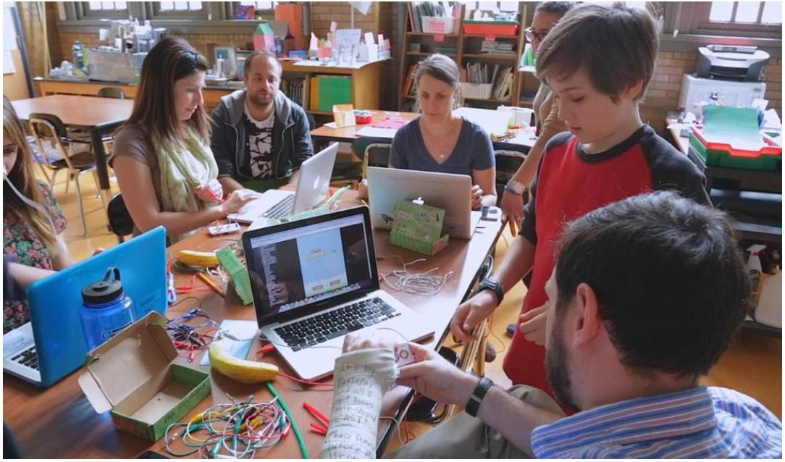

# ATIVIDADE 05

|   ALUNO       |   IZAEL ALVES DA SILVA   |
|:---------------|:--------------------------|
|   PROFESSOR    |   JOAO RAFAEL GONCALVES EVANGELISTA          |
|   DISCIPLINA  |   SEGURANÇA DA INFORMAÇÃO |

 

## Classificação da Informação

Considere o seguinte cenário para responder as questões a seguir:

Você é integrante do time de **Especialistas em Segurança da Informação** da empresa "**Sonny**" e precisa desenvolver uma **Política de Segurança da Informação (PSI)** para classificar as informações utilizadas pelos desenvolvedores de jogos. Será através desta classificação, que novas estratégias de segurança planejadas poderão ser desenvolvidas e implementadas na empresa "**Sonny**".

A "**Sonny**" é uma empresa de destaque no mercado internacional de tecnologia atuando na área de desenvolvimento de jogos e sistemas de Gamificação. Sobre **Jogos Digitais** e **Gamificação**:
- https://micropowerglobal.com/games-e-gamificacao/
- https://ecdd.blog/guia-tudo-sobre-gamificacao-jogos-serios-e-advergames/
- https://coc.com.br/blog-aprendizagem/como-jogos-digitais-e-gamificacao-potencializam-a-aprendizagem

## Classificação da Informação - Jogos Digitais e Gamificação

> #### 1. Cite 03 exemplos de informações podem ser classificadas como "Secretas" no cenário da Empresa "Sonny" (Uma Empresa que atua com Gameficação de Processos)?

Informações que, se divulgadas, causariam graves danos estratégicos à empresa:

- Estratégias de lançamento global de um novo jogo.
- Documentos de negociação com investidores e grandes Publisher internacionais.
- Roadmap estratégico de longo prazo para expansão em novos mercados.

---

> #### 2. Cite 03 exemplos de informações podem ser classificadas como "Confidenciais" no cenário da Empresa "Sonny" (Uma Empresa que atua com Gameficação de Processos)?

Informações sensíveis, mas que circulam entre equipes específicas:

- Código-fonte dos jogos e plataformas de gamificação.
- Modelos de Inteligência Artificial usados em mecânicas de jogo.
- Banco de dados com estatísticas de jogadores e clientes corporativos.

---
 
> #### 3. Cite 03 exemplos de informações podem ser classificadas como "Restritas" no cenário da Empresa "Sonny" (Uma Empresa que atua com Gameficação de Processos)?

Informações críticas de segurança e infraestrutura:

- Credenciais de acesso a servidores de desenvolvimento e produção.
- Chaves criptográficas usadas para proteger transações e dados.
- Arquitetura de rede e planos de contingência contra ataques cibernéticos.

---

> #### 4. Cite 03 exemplos de informações podem ser classificadas como "Internas" no cenário da Empresa "Sonny" (Uma Empresa que atua com Gameficação de Processos)?

De uso apenas dentro da organização, sem risco crítico em caso de vazamento:

- Relatórios internos de desempenho de projetos.
- Procedimentos operacionais e tutoriais de ferramentas de trabalho.
- Atas de reuniões entre times de desenvolvimento.

---

> #### 5. Cite 03 exemplos de informações podem ser classificadas como "Públicas" no cenário da Empresa "Sonny" (Uma Empresa que atua com Gameficação de Processos)?

De acesso aberto, sem risco à segurança da empresa:

- Material de marketing e divulgação (trailers, teasers, posts em redes sociais).
- Artigos institucionais sobre gamificação publicados no blog da Sonny.
- Vagas de emprego anunciadas em portais de recrutamento.

    
    
    
    
   

   👋 Feito com ❤️ by Izael Silva 👋

